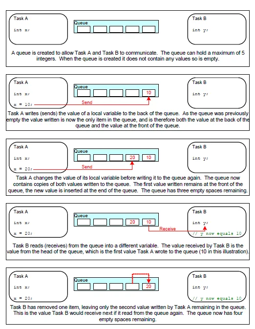

# CMSIS-RTOS 笔记

## 创建任务
### 启用 RTOS
1. 在 Middleware -> FreeRTOS 的选项卡中启用 RTOS
1. 使用 CMSIS-RTOS V2 API
1. 在 Tasks and Queues 选项卡中创建任务

### 配置任务属性
1. Task Name: 设置任务的名称, 将基于此名字建立一个指向任务的句柄  
    * 任务句柄定义于 Core/Src/freertos.c 中
1. Entry Function: 设置任务的函数名  
    * 注意任务函数名是否正确
1. Priority: 设置任务的优先级, 高优先级的任务会抢占低优先级的任务
1. Stack Size: 设置任务栈的大小, 用于储存任务相关的变量
1. Allocation: 设置任务所在的地方, 选择动态的话是生成在堆中, 选择静态的话则生成在静态区
1. Parameter: 传递给任务的参数
1. Code Generation Option: 设置任务函数的生成方式
    * Default 在 Core/Src/freertos.c 中编辑任务函数
    * As weak 在其他 .c 文件中定义任务函数, 不需要声明
    * As extern 在 .cpp 文件中定义任务函数, 需要使用 `extern "C"` 包裹, 其余同 As weak

### 定义任务函数
任务函数的基本格式如下
```c
// 函数名即 Entry Function 中确定的名称
// 任务函数要有参数 void *argument
void TaskFunction(void *argument)
{
    // 在一个死循环中执行任务内容
    while(1)
    {
        ...
        // 一般使用 osDelay 完成延时功能
        osDelay(1000);        
    }
    vTaskDelete(NULL);
}
```

更多有关内容见[任务基本模式](#任务基本模式)

### 相关函数
1. `osDelay(uint32_t ticks)` 任务延时函数  
    * 参数 `ticks` 为等待的任务刻, 可通过参数配置中的 TICK_RATE_HZ 参数设置
    * 该函数将使任务暂时挂起以之心其他任务
1. `osKernelStart()` 启动任务调度
    * 在 CubeMX 中, 该函数已经在 main 函数中调用, 且在 while 循环之前

### 查看任务堆栈占用情况
1. 一个任务包含Stack区 (用于储存任务相关的变量) 和任务控制块TCB区 (Task Control Block, 用于储存任务本身的设置)
1. FreeRTOS Heap Usage 选项卡中, 可以查看堆栈使用情况
1. 任务占用字节数 = TCB_size + (4 x Task stack size)

## 内存管理
### 简介
1. 栈 (stack): 由编译器自动分配和释放, 如存放函数的参数值, 局部变量的值
1. 堆 (heap): 一般由程序员分配和释放, 通过 new / delete 控制, 位于 SRAM 上

### 任务分配空间
1. 当调用 FreeRTOS 的创建任务 API 函数 xTaskCreate() 时, FreeRTOS会在堆中开辟出一块空间, 用于存放任务的控制信息 TCB 块和栈区 Stack 用于储存任务相关的变量
1. TCB 块的大小取决于 FreeRTOSConfig.h 头文件中的设置
    1. 在最小的设置下TCB块的大小是 96 字节
    1. 如果 configUSE_TASK_NOTIFICATIONS 是1的话再增加8个字节
    1. 如果 configUSE_TRACE_FACILITY 是1的话再增加8个字节
    1. 如果 configUSE_MUTEXES 是1的话再增加8个字节

### MSP 和 PSP 栈指针
#### MSP 指针
* 主堆栈指针 (Main stack pointer)
* 用于操作内核以及处理异常和中断
* 由编译器分配

#### PSP 指针
* 用于每个任务的独立的栈指针, 用于用户的任务
* 在任务调度上下文切换 (context switch) 中，PSP 会初始化为相对应的任务的栈指针，如下图所示

### 内存池分配
* 当 FreeRTOS 需要 RAM 的时候，它会调用 `pvPortMalloc` 这个函数而不是 malloc 这个系统函数
* 当它需要释放内存的时候，会调用 `vPortFree` 这个函数而不是 free 这个系统函数
* FreeRTOS 提供了五个 `pvPortMalloc` 和 `vPortFree` 的实现方案
* 可以在 CubeMX 中, FreeRTOS -> Config Parameters -> Memory Management Setting 中设置
* 由于通常的 free 与 malloc 不可使用, 在 C++ 中, 需要重载 new 与 delete, [参考](https://blog.csdn.net/qq_34269632/article/details/115618386)

#### 分配方案
1. Heap_1 适用于小型的嵌入式系统  
只能在调度器启动之前创建任务和其它内核对象, 之后任务的内存分配在程序的运行周期中保持不变并且无法被释放
1. Heap_2 FreeRTOS 向旧版本兼容的方案  
不推荐使用
1. Heap_3 基于标准库  
使用标准库里的 malloc 和 free 函数，所以堆的大小由链接器配置决定, 使用场景不多
1. Heap_4 适用于通用的应用, 也是默认应用  
由一个数组表示堆, 并把数组分割成小的内存块, 堆的大小由 configTOTAL_HEAP_SIZE 定义
1. Heap_5 类似于Heap_4  
Heap_5 可以用不同的数组空间对内存进行分配, 使用 vPortDefineHeapRegions 函数指定额外空间

### 内存管理函数
1. `void *pvPortMalloc(size_t xSize)` 申请内存空间  
    * 参数 `xSize` 为申请空间的字节数
    * 申请成功时返回指向申请空间的指针
    * 应使用该函数代替 malloc
1. `void vPortFree(void *pv)` 释放内存空间
    * 参数 `pv` 为指向申请空间的指针
    * 应使用该函数代替 free
1. `size_t xPortGetFreeHeapSize()` 获取堆中的剩余空间  
1. `size_t xPortGetMinimumEverFreeHeapSize()` 获取堆的最小剩余空间  
只能在 Heap_4 或者 Heap_5 下调用
1. `void vApplicationMallocFailedHook()` 内存获取失败时调用的回调函数  
需要用户实现的回调函数

## 任务管理
### 任务
在FreeRTOS中, 线程 (Thread) 和任务 (Task) 的概念是相同的, 每个任务就是一个线程

### 任务基本模式
```cpp
void TaskFunction( void *pvParameters )
{
    while(1)
    {
        ...
    }
    vTaskDelete(NULL);  
}
```
* 这个任务函数不能有返回值 (即使用 `return` 语句), 不然会导致异常
* 如果不需要这个任务的话, 必须要用语句显示地删除这个任务 (比如调用 `vTaskDelete()` 这个函数)
* 任务具有以下状态
    1. 就绪状态 (Ready)  
    当任务没有被阻塞或者挂起等待运行的时候处于此状态
    1. 运行状态 (Running)  
    当任务被内核调度执行的时候处于此状态
    1. 阻塞状态 (Blocked)  
    当任务等待某个事件或信号的时候处于此状态
    1. 挂起状态 (Suspended)  
    当任务被 vTaskSuspend() 函数禁止运行的时候处于此状态


### 调度器
* FreeRTOS 中采用了 round-robin 的调度算法, 包含抢占式 (preemptive) 和合作式 (cooperative) 两种模式
* 模式的选择由参数 `USE_PREEMPTION` 决定

#### 抢占式模式
在抢占式模式下, 在每次调度器运行时, 高优先级的任务会被切换优先执行, 当前处于运行状态的低优先级的任务则会立刻进入就绪状态等待运行

#### 合作式模式
在合作式模式下, 高优先级任务不会抢占当前正在运行状态的低优先级任务, 直到低优先级任务进入以下状态才会切换任务
1. 完成进入阻塞状态 (比如调用 `osDelay()` 函数)
1. 就绪状态 (比如调用 `osThreadYield()` 函数)
1. 被系统置于挂起状态后

#### 抢占式无时间片调度
* 需要设置 `USE_TIME_SLICING` 以关闭时间片
* 这种调度方式下, 因为没有采取时间片, 所以调度器的执行开销会比较小
* 在抢占式无时间片调度下, 当前运行的任务会一直运行, 直到它进入阻塞或者挂起状态, 另一个相同优先级的任务才会运行

### 任务的调度
* FreeRTOS 对任务的调度采用基于时间片 (time slicing) 的方式
* 即把一段时间等分成了很多个时间段, 在每个时间片结束后, 进入内核调度任务, 保证优先级最高的任务能执行或使相同优先级的轮流使用每个时间段占用 CPU 资源
* 时间片的大小由参数 `TICK_RATE_HZ` 设置
* 因此, 在 FreeRTOS 内时间的最小单位是一个节拍 (tick), 延时函数 `vTaskDelayUntil` 和 `vTaskDelay` 的参数需要的是延时的节拍数, 不能直接设置延时时间
* 可以使用函数 `pdMS_TO_TICKS()` 将时间转为节拍数

### 空闲任务
* 空闲任务是调度器在 `vTaskStartScheduler` 函数调用启动后自动创建的一个任务
* 空闲任务具有最低的优先级0, 当用户创建的任务都在阻塞状态或挂起状态时, 空闲任务便得以执行
* 最低的优先级确保空闲任务不会抢占用户任务, 同时空闲任务负责清理内核的资源
* 空闲任务可以绑定一个钩子任务 (Task Hook), 当空闲任务运行的时候钩子任务也会被自动调用
* 钩子任务的函数原型是 `vApplicationIdleHook(void)`, 可以由用户定义

## 队列管理


### 关于队列
#### 全局变量和弊端
* 使用全局变量将导致线程不安全, 一种解决这个问题的方案就是采用队列
* 队列提供了一种任务间或者任务和中断间的通讯机制

#### 队列
* 队列是先进先出 FIFO (First In First Out), 先进先出表示的是先写入的数据会先被读取
* 队列中的数据必须是相同类型的, 可以是基本类型也可以是结构体
* FreeRTOS 采用是复制队列的实现方式, 即写入队列的数据每个字节都被完整复制到队列, 不通过引用方式保存
* 如果使用指针管理队列, 可能指针的资源已被销毁, 但留在队列中导致错误
* 当一个任务试图从队列读取数据的时候, 它可以设置一个阻塞时间 (block time), 这是当队列数据为空时, 任务处于阻塞状态的时间, 当有数据在队列或者到达阻塞时间的时候，任务都会进入就绪状态
* ==将队列定义为全局变量, 各个任务通过队列传输数据==

### 队列操作方法
参考文档 <https://arm-software.github.io/CMSIS_5/RTOS2/html/group__CMSIS__RTOS__Message.html>

#### 创建队列
```c
osMessageQueueId_t osMessageQueueNew(
    uint32_t msg_count, 
    uint32_t msg_size, 
    const osMessageQueueAttr_t *attr)
```
* 参数 `msg_count` 队列长度  
* 参数 `msg_size` 队列单元大小  
单位为字节, 对于特定类型的单元, 使用 sizeof 计算即可
* 参数 `attr` 队列属性  
一般使用 `NULL` 即可
* 返回值为队列句柄, 当创建失败时返回 `NULL`  

#### 读取数据
```cpp
osStatus_t osMessageQueueGet(
    osMessageQueueId_t mq_id,
    void * msg_ptr,
    uint8_t * msg_prio,
    uint32_t timeout 
)	
```
* 参数 `mq_id` 队列句柄
* 参数 `msg_ptr` 单个数据保存位置指针
* 参数 `msg_prio` 优先数据指针, 一般为 `NULL` 即可
* 参数 `timeout` 读取等待事件  
    * 设置为 `0` 时, 可在中断函数中使用
    * 设置为 `osWaitForever` 时, 可用于阻塞任务等待数据

#### 写入数据
```cpp
osStatus_t osMessageQueuePut(
    osMessageQueueId_t mq_id,
    const void * msg_ptr,
    uint8_t msg_prio,
    uint32_t timeout 
)	
```
* 参数 `mq_id` 队列句柄
* 参数 `msg_ptr` 单个数据发送位置指针
* 参数 `msg_prio` 优先数据指针, 一般为 `NULL` 即可
* 参数 `timeout` 读取等待事件  
    * 设置为 `0` 时, 可在中断函数中使用
    * 设置为 `osWaitForever` 时, 可用于阻塞任务等待数据

## 错误排查与技巧
### 异常处理
调用 `main.h` 中的 `Error_Handler()` 函数可强制进入错误状态

### pvPortMalloc 申请失败
当进入错误状态 `Error_Handler` 时, 上层调用为 `pvPortMalloc`  
可以在 FREERTO -> Heap Usage 检查堆空间是否不足, 可通过调大参数 `TOTAL_HEAP_SIZE` 解决

### 上电死机复位后正常
参考 <https://blog.csdn.net/wevsa/article/details/25402805>

在初始化前, 一般为 `USER CODE BEGIN Init` 前, 使用 `HAL_Delay` 添加一个短时间的延时 (通常为 100)
