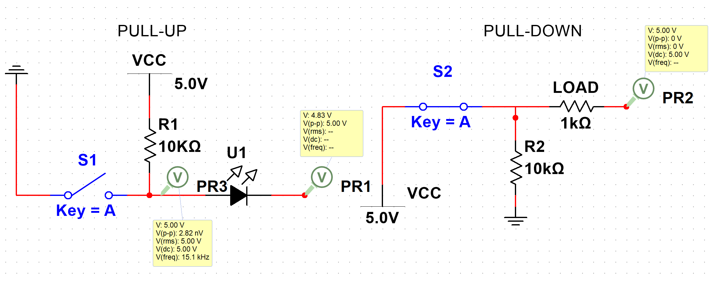
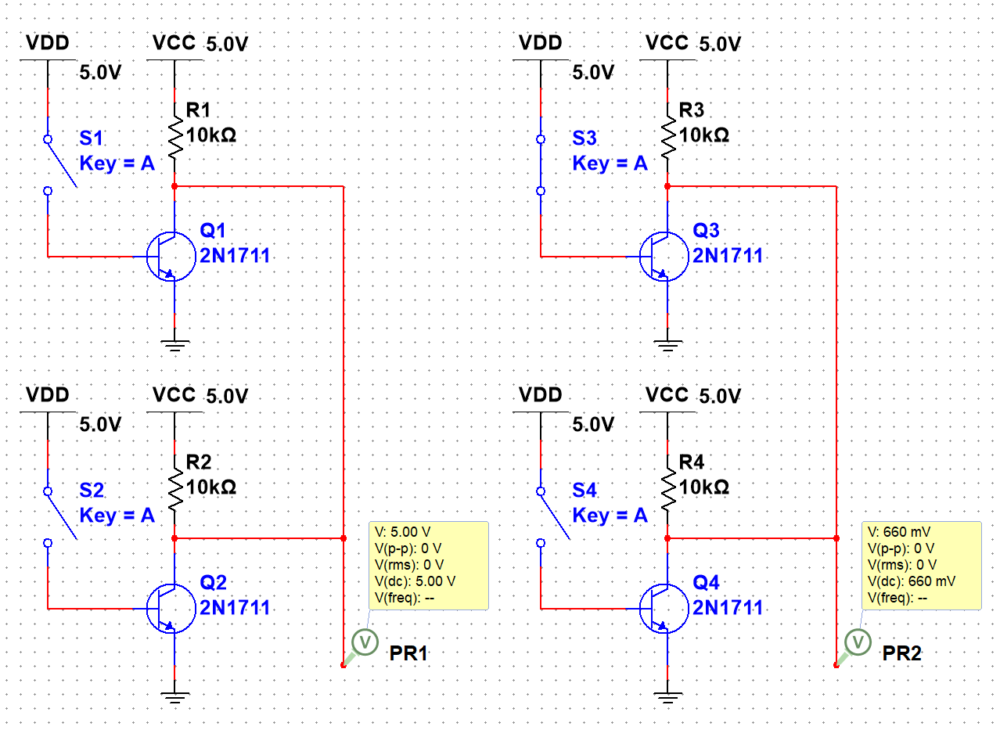

# 通用输入输出 GPIO

## 外设介绍

### 电路理论
<!-- [仿真结果](https://github.com/tonyddg/icublog/tree/main/electronic/src) -->
#### 基本部分
1. 电源
    * VCC：C=circuit 表示电路的意思, 即接入电路的电压
    * VDD：D=device 表示器件的意思, 即器件内部的工作电压;
    * VSS：S=series 表示公共连接的意思，通常指电路公共接地端电压
2. 接地 GUN

#### 端口
电路中的高电平与低电平需要通过与电源或接地的连接体现
电源 => 端口 高电平
端口 => 接地 低电平
其他情况在电路中不允许出现

当端口与电源连接时, 端口视为与接地连接了一个阻止为无穷大的电阻
与接地连接时同

#### 上拉与下拉

##### 上拉电路
<div id="pullup_figure"></div>

1. 开关断开时, 上拉电阻 R1 与 端口串联, 端口视为一个电压无限的的电阻, 因此上拉电阻分压为 0, 端口为高电平
2. 开关闭合时, 端口与开关通路并联向接地, 端口电压与通路相同, 由于通路上电阻为零, 并联电路等效电阻即为 0, 即端口被短路, 为低电平

* 上拉电阻可以在开关闭合时分得电源向接地的电压 (上拉电阻与零电阻的端口并联电路串联)
* 开关另一侧不能有电阻, 否则开关闭合时, 端口不会短路, 产生未知电平

##### 下拉电阻
<div id="pulldown_figure"></div>

1. 开关断开时, 下拉电阻 R2 与 端口串联, 端口为低电平
2. 开关闭合时, 端口与下拉电阻并联, 端口电压与下拉电阻相同, 由于电源为通路, 端口与下拉电阻并联部分的电路分得电源电压, 为高电平

* 下拉电阻可以在开关闭合时分得电源向接地的电压, 使端口也能获得高电平
* 开关另一侧不能有电阻, 否则开关闭合时, 端口与下拉电阻并联部分不能分得全部电压, 产生未知电平

#### 推挽输出
<div id="pullpush_figure"></div>


1. 输入高电平时, Q3 开启, Q4 关闭, 电源向负载导通
2. 输入低电平时, Q3 关闭, Q4 开启, 电源接地, 负载被短路
用于快速切换开关时

#### 开漏输出
<div id="opendrain_figure"></div>


1. 输入高电平时, Q5 开启, 电源接地, 负载被短路
2. 输入低电平时, Q5 关闭, 电源向负载导通, 并经过上拉电阻
可以用于线与功能

#### 线与

线与既仅通过线路的连接实现 and 运算的功能
1. 左侧两个开漏输入部分均为高电平, 连接端口后, 输出高电平
2. 右侧上方的开楼漏输入部分为低电平, 下方为高电平, 低电平一侧与接地直接导通, 导致总端口被短路, 为低电平

### GPIO 的基本模式
#### 开漏输出
[电路原理](#opendrain_figure)
OUT_OD 可实现线与功能, 主要用于 I^2^C 中的总线
在高频的驱动电路中，噪声很高
#### 推挽输出
[电路原理](#pullpush_figure)
OUT_PP 可以实现快速开启与关闭 常用于输出高/低电平
#### 复用开漏输出
AF_OD
用于 STM32 内部的 I^2^C 外设
#### 复用推挽输出
AF_PP
用于 STM32 内部的 SPI, USART 等外设
#### 浮空输入
IN_FLOATING 端口直接与输入连接, 此时默认输入电平不确定, 因此输入端最好接地或接 VCC
#### 上拉输入
[电路原理](#pullup_figure)
IPU 默认输入高电平, 当输入低电平时变为低电平
#### 下拉输入
[电路原理](#pulldown_figure)
IPD 默认输入低电平, 当输入高电平时变为高电平
#### 模拟输入
AIN 端口直接与 ADC 模块连接, 且不进行任何转换, 不使用时, 功耗最低

## 标准库配置
### 初始化
使用结构体 GPIO_InitStructure 定义初始化信息
```cpp
struct GPIO_InitStructure
{
    //初始化的引脚
    //使用宏 GPIO_Pin_x 作为参数
    std::uint16_t GPIO_Pin;

    //设置模式
    //f10x GPIO_Mode_In/Out_xxx 设置为输入/输出/复用等
    //f4xx GPIO_Mode_IN/OUT
    enum GPIO_Mode;

    //设置引脚速率
    //使用宏 GPIO_Speed_xxx 作为参数
    enum GPIO_Speed

    //设置引脚上拉/下拉
    //参数 GPIO_PuPd_UP / GPIO_PuPd_DOWN / GPIO_PuPd_NOPULL
    //仅用于 STM32F4XX
    enum GPIO_PuPd

    //设置输出模式
    //有推挽与开漏两种
    enum GPIO_OType
};
```

void GPIO_Init(GPIO_TypeDef* GPIOx, GPIO_InitTypeDef* GPIO_InitStruct)
执行初始化

1. GPIOx 为初始化端口的寄存器地址 , 可以直接使用 GPIOx 作为参数(已定义的端口宏)
2. GPIO_InitStruct 为初始化信息结构体的地址

### 电平控制
void GPIO_SetBits(GPIO_TypeDef* GPIOx, uint16_t GPIO_Pin)
设置指定阵脚为高电平
void GPIO_ResetBits(GPIO_TypeDef* GPIOx, uint16_t GPIO_Pin)
设置指定阵脚为低电平

### 读取
uint8_t GPIO_ReadInputDataBit(GPIO_TypeDef* GPIOx, uint16_t GPIO_Pin)
读取指定阵脚的电平

### 时钟初始化
void RCC_XXXXPeriphClockCmd(uint32_t RCC_XXXXPeriph, FunctionalState NewState)
初始化指定总线与端口的 RCC 时钟, 保证 GPIO 正常工作 
查询芯片 GPIO 所在的桥进行初始化

1. RCC_XXXXPeriph 初始化的RCC, 使用宏 RCC_XXXXPeriph_GPIOx 作为参数
2. NewState 设置状态, 初始化则使用 ENABLE

## HAL 库配置
1. 设置引脚电平
```c
void HAL_GPIO_WritePin(GPIO_TypeDef* GPIOx, uint16_t GPIO_Pin, GPIO_PinState PinState);
```
2. 读取引脚的电平状态
```c
GPIO_PinState HAL_GPIO_ReadPin(GPIO_TypeDef* GPIOx, uint16_t GPIO_Pin);
```

