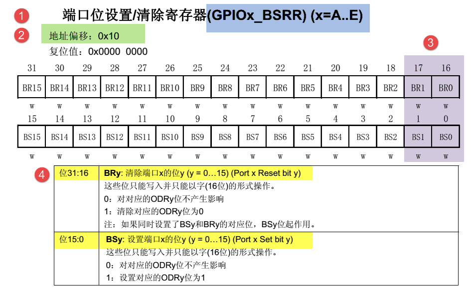

# STM32 芯片基本知识
## 芯片结构
### 总线
1. ICode 总线 读取指令
2. DCode 总线 读取数据
3. System 总线 读取寄存器
### 被动单元
1. Flash 内部闪存存储器
    存放程序与 const 数据, ICode 从此处访问程序
2. SRAM 程序的变量与堆栈基于 SRAM
    通过 DCode 总线访问
3. AHB 到 APB 的桥
    挂载在 STM32 上的外设

### 存储器映射
存储器映射即给存储器分配地址
被动单元功能部件共同排列在 4GB 的地址!空间内
以 512 MB 为一个 BLOCK 划分地址空间
1. Block0 Flash
2. Block1 SRAM
3. Block2 APB 与 AHB

## 寄存器映射
存储器映射的内存单元起别名, 即内存映射
通过绝对地址或起别名的方式访问内存单元
``` c
//将绝对地址转为 unsigned int* 类型
//在通过 * 访问值
#define GBIOP_ORD   *(unsigned int*) (0x4001 0C0C)
GBIOP_ORD = 0xFF;
```
### 总线
1. APB1 挂载低速外设
2. APB2 与 AHB 挂载高速外设
3. GPIO 挂载在 APB2 的外设 - 通用输入输出端口, 控制引脚输出高低电频 
### 外设地址映射
Block2 => 总线基地址 => 外设基地址 => 外部寄存器

Block2(+0x4000 0000) =>  APB2 (+ 0x0001 0000) => GPIOB (+0x0000 0C00) => GPIOB_ODR(+0x0C)

通过一些列偏移得到寄存器基地址

### 寄存器说明
通过查找手册, 了解寄存器信息

1. 名称
(GPIOx_BSRR)(x=A...E) 寄存器名为 GPIOx_BSRR, 适用于 GPIOA...GPIOE
2. 地址偏移
GPIOx_BSRR 地址偏移为 0x10 表明, 寄存器对于外设基地址的偏移为0x18, 通过查找外设偏移等信息, 得到寄存器的基地址
3. 寄存器位表
表明寄存器存储单元(32位)中各位的名称及读写权限
r 表示只读, w 表示只写
没有 r, 不是不能读取, 只是读取无意义
3. 位功能说明
介绍寄存器每一位的作用

### 在 C 中封装寄存器
#### 总线与外设的基地址
1. 通过宏与各层偏移得到寄存器基地址
```c
// 外设基地址
#define PERIPH_BASE ((unsigned int)0x4000 0000)

// 总线基地址
#define APB1PERIPH_BASE PERIPH_BASE
#define APB2PERIPH_BASE (PERIPH_BASE + 0x0001 0000)
#define AHBPERIPH_BASE (PERIPH_BASE + 0x0002 0000)

// GPIO 外设基地址
#define GPIOA_BASE (APB2PERIPH_BASE + 0x0800)
#define GPIOB_BASE (APB2PERIPH_BASE + 0x0C00)
...

// 寄存器基地址
#define GPIOB_BSRR (GPIOB_BASE + 0x0800)
...

//访问GPIOB_BSRR, 并将寄存器第 16 位置 1
* (unsigned int *) GPIOB_BSRR = (0x01 << (16 + 0));

```

2. 封装寄存器列表
```c
typedef unsigned int    uint32;// 32位寄存器
typedef unsigned short  uint16;// 16位寄存器

// 按外设中各个寄存器的大小, 偏移定义对应结构, 便于访问
typedef struct
{
    uint32 CRL;
    uint32 CRH;
    ...
    uint16 LCKR;
} GPIOx // C 中定义类似C++的结构时需要使用此语法

//使用变量方式
GPIOx *GPIOB = GPIOB_BASE;
//使用宏方式
#define GPIOB ((GPIOx*) GPIOB_BASE)

// 通过结构访问
GPIOB-> CRL = 0xFFFF;
```

#### 操作寄存器的位
1. 对某位清零
```c
uint32 a = 0xFFFF;
a &= ~(0x01 << n);
```
以 n = 3 为例
* 0x01 << n 二进制 0x01 左移 3 位得到 1000b(0x08)
* ~(0x01 << n) 对 1000b 取反(uint32 变量) 得到 0xFFF7
* &= 令 a 与 0xFFF7 和运算, 由于 0xFFF7 第 3 位为 0, 实现使 a 的第三位置零 

2. 连续清零
```c
uint32 a = 0xFFFF;
a &= ~(0b1111 << 4);
```

同 1, 将第 5 - 8 位清零

3. 对寄存器的位赋值
```c
uint32 a = 0;
a |= (0x01 << n);
```

n = 3 时, 得到 0b1000;

4. 对位取反
```c
uint32 a = 0xF;
a ^= (0x01 << n);
```

n = 3 时, 得到 0b0111;
