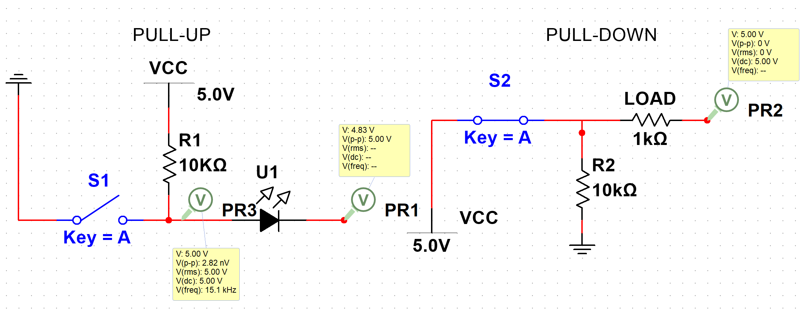
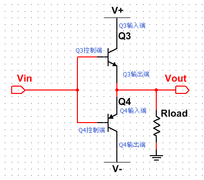
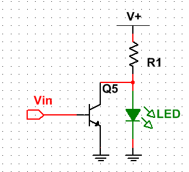
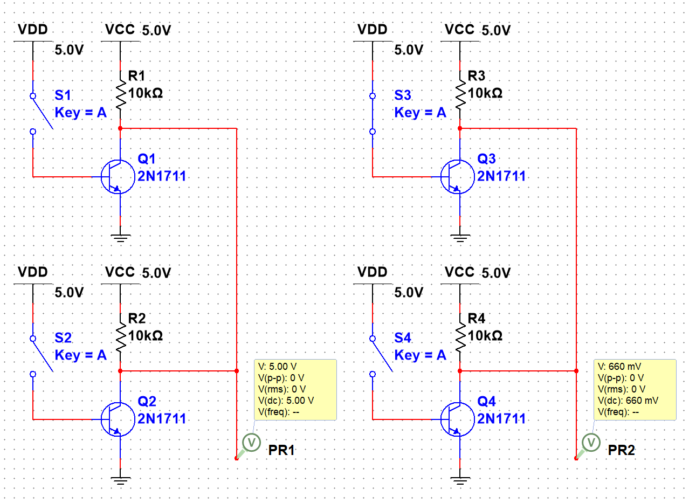

# 芯片基础
## 芯片结构
### 总线
1. ICode 总线 读取指令
2. DCode 总线 读取数据
3. System 总线 读取寄存器
### 被动单元
1. Flash 内部闪存存储器
    存放程序与 const 数据, ICode 从此处访问程序
2. SRAM 程序的变量与堆栈基于 SRAM
    通过 DCode 总线访问
3. AHB 到 APB 的桥
    挂载在 STM32 上的外设
## 存储器映射
存储器映射即给存储器分配地址
被动单元功能部件共同排列在 4GB 的地址空间内
以 512 MB 为一个 BLOCK 划分地址空间
1. Block0 Flash
2. Block1 SRAM
3. Block2 APB 与 AHB
## 寄存器映射
存储器映射的内存单元起别名, 即内存映射
通过绝对地址或起别名的方式访问内存单元
``` c
//将绝对地址转为 unsigned int* 类型
//在通过 * 访问值
#define GBIOP_ORD   *(unsigned int*) (0x4001 0C0C)
GBIOP_ORD = 0xFF;
```
### 总线
1. APB1 挂载低速外设
2. APB2 与 AHB 挂载高速外设
3. GPIO 挂载在 APB2 的外设 - 通用输入输出端口, 控制引脚输出高低电频 
### 外设地址映射
Block2 => 总线基地址 => 外设基地址 => 外部寄存器

Block2(+0x4000 0000) =>  APB2 (+ 0x0001 0000) => GPIOB (+0x0000 0C00) => GPIOB_ODR(+0x0C)

通过一些列偏移得到寄存器基地址

### 寄存器说明
通过查找手册, 了解寄存器信息

1. 名称
(GPIOx_BSRR)(x=A...E) 寄存器名为 GPIOx_BSRR, 适用于 GPIOA...GPIOE
2. 地址偏移
GPIOx_BSRR 地址偏移为 0x10 表明, 寄存器对于外设基地址的偏移为0x18, 通过查找外设偏移等信息, 得到寄存器的基地址
3. 寄存器位表
表明寄存器存储单元(32位)中各位的名称及读写权限
r 表示只读, w 表示只写
没有 r, 不是不能读取, 只是读取无意义
3. 位功能说明
介绍寄存器每一位的作用

### 在 C 中封装寄存器
#### 总线与外设的基地址
1. 通过宏与各层偏移得到寄存器基地址
```c
// 外设基地址
#define PERIPH_BASE ((unsigned int)0x4000 0000)

// 总线基地址
#define APB1PERIPH_BASE PERIPH_BASE
#define APB2PERIPH_BASE (PERIPH_BASE + 0x0001 0000)
#define AHBPERIPH_BASE (PERIPH_BASE + 0x0002 0000)

// GPIO 外设基地址
#define GPIOA_BASE (APB2PERIPH_BASE + 0x0800)
#define GPIOB_BASE (APB2PERIPH_BASE + 0x0C00)
...

// 寄存器基地址
#define GPIOB_BSRR (GPIOB_BASE + 0x0800)
...

//访问GPIOB_BSRR, 并将寄存器第 16 位置 1
* (unsigned int *) GPIOB_BSRR = (0x01 << (16 + 0));

```

2. 封装寄存器列表
```c
typedef unsigned int    uint32;// 32位寄存器
typedef unsigned short  uint16;// 16位寄存器

// 按外设中各个寄存器的大小, 偏移定义对应结构, 便于访问
typedef struct
{
    uint32 CRL;
    uint32 CRH;
    ...
    uint16 LCKR;
} GPIOx // C 中定义类似C++的结构时需要使用此语法

//使用变量方式
GPIOx *GPIOB = GPIOB_BASE;
//使用宏方式
#define GPIOB ((GPIOx*) GPIOB_BASE)

// 通过结构访问
GPIOB-> CRL = 0xFFFF;
```

#### 操作寄存器的位
1. 对某位清零
```c
uint32 a = 0xFFFF;
a &= ~(0x01 << n);
```
以 n = 3 为例
* 0x01 << n 二进制 0x01 左移 3 位得到 1000b(0x08)
* ~(0x01 << n) 对 1000b 取反(uint32 变量) 得到 0xFFF7
* &= 令 a 与 0xFFF7 和运算, 由于 0xFFF7 第 3 位为 0, 实现使 a 的第三位置零 

2. 连续清零
```c
uint32 a = 0xFFFF;
a &= ~(0b1111 << 4);
```

同 1, 将第 5 - 8 位清零

3. 对寄存器的位赋值
```c
uint32 a = 0;
a |= (0x01 << n);
```

n = 3 时, 得到 0b1000;

4. 对位取反
```c
uint32 a = 0xF;
a ^= (0x01 << n);
```

n = 3 时, 得到 0b0111;

## 项目管理
### 准备文件
1. 选择对应型号 搜索 标准外设库 获取标准外设文件
[ST官网](https://www.st.com/zh/microcontrollers-microprocessors/)
2. 安装 ST-LINK/V2 驱动
[下载地址](https://www.st.com/en/development-tools/stsw-link009.html)

### 下载程序
1. 连接 ST-LINK V2, 打开魔术棒
2. 魔术棒 => Debug => Use ST LINK
3. Settings => Unit => ST-LINK V2
4. Port => SW
5. Flash Download => Reset and Run

### 手册查询
1. 开发板原理图 => 引脚分配表 查询引脚功能
2. STM32参考资料 => STM32F4xx中文参考手册 查询寄存器信息
4. STM32F4xx中文参考手册 => 存储器映射 查询各外设的基地址
5. 参考手册其他章节 => 查询外设寄存器的地址与功能
(4 查询外设基地址 5 查询寄存器相对于外设的偏移地址)

## 电路理论
[仿真结果](https://github.com/tonyddg/icublog/tree/main/electronic/stm32_src)
### 基本部分
1. 电源
    * VCC：C=circuit 表示电路的意思, 即接入电路的电压
    * VDD：D=device 表示器件的意思, 即器件内部的工作电压;
    * VSS：S=series 表示公共连接的意思，通常指电路公共接地端电压
2. 接地 GUN

### 端口
电路中的高电平与低电平需要通过与电源或接地的连接体现
电源 => 端口 高电平
端口 => 接地 低电平
其他情况在电路中不允许出现

当端口与电源连接时, 端口视为与接地连接了一个阻止为无穷大的电阻
与接地连接时同

### 上拉与下拉

#### 上拉电路
<div id="pullup_figure"></div>

1. 开关断开时, 上拉电阻 R1 与 端口串联, 端口视为一个电压无限的的电阻, 因此上拉电阻分压为 0, 端口为高电平
2. 开关闭合时, 端口与开关通路并联向接地, 端口电压与通路相同, 由于通路上电阻为零, 并联电路等效电阻即为 0, 即端口被短路, 为低电平

* 上拉电阻可以在开关闭合时分得电源向接地的电压 (上拉电阻与零电阻的端口并联电路串联)
* 开关另一侧不能有电阻, 否则开关闭合时, 端口不会短路, 产生未知电平

#### 下拉电阻
<div id="pulldown_figure"></div>

1. 开关断开时, 下拉电阻 R2 与 端口串联, 端口为低电平
2. 开关闭合时, 端口与下拉电阻并联, 端口电压与下拉电阻相同, 由于电源为通路, 端口与下拉电阻并联部分的电路分得电源电压, 为高电平

* 下拉电阻可以在开关闭合时分得电源向接地的电压, 使端口也能获得高电平
* 开关另一侧不能有电阻, 否则开关闭合时, 端口与下拉电阻并联部分不能分得全部电压, 产生未知电平

### 推挽输出
<div id="pullpush_figure"></div>


1. 输入高电平时, Q3 开启, Q4 关闭, 电源向负载导通
2. 输入低电平时, Q3 关闭, Q4 开启, 电源接地, 负载被短路
用于快速切换开关时

### 开漏输出
<div id="opendrain_figure"></div>


1. 输入高电平时, Q5 开启, 电源接地, 负载被短路
2. 输入低电平时, Q5 关闭, 电源向负载导通, 并经过上拉电阻
可以用于线与功能

### 线与

线与既仅通过线路的连接实现 and 运算的功能
1. 左侧两个开漏输入部分均为高电平, 连接端口后, 输出高电平
2. 右侧上方的开楼漏输入部分为低电平, 下方为高电平, 低电平一侧与接地直接导通, 导致总端口被短路, 为低电平

## STM32 标准库
下载对应芯片的标准外设库
[ST官网](https://www.st.com/content/st_com/zh.html)
产品 => 微控制器与微处理器 => 选择对应型号 => 工具与软件 => 搜索 标准外设库

### 标准库结构
1. Libraries
固件库等的源代码及启动文件
2. Project
驱动库的例子与工程模板
3. Utilities
官方实验板的范例程序
4. xxx.chm
库函数说明

#### Libraries\CMSIS
1. .\CoreSupport\core_cmx.h(c)
    * 内核寄存器映射
    * 包含 stdint.h 定义 uint16_t 等类型

2. .\Device\ST\STM32F4xx\Source\Templates\arm
    * 文件启动
    * 后缀 nd 表示根据芯片容量选择

3. stm32f10x.h
    实现芯片上外设的寄存器映射

4. system_stm32f10x.c
    * 实现 stm32 的时钟配置 默认 72MHz
    * SystemInit 在此调用

#### Libraries\xxxDriver
1. inc 与 src
    包含了各个外设的头文件与源文件, 可根据需要选用

2. stm32f10x_it.c
    中断服务函数

3. system_stm32f10x.c
    同上

4. stm32f10x_conf.h
    * 包含了所有外设库的头文件
    * 配置 断言 编译选项, 定义 USE_FULL_ASSERT 与 assert_failed(错误时发出消息) 函数

## GPIO 库函数

### 模式
#### 开漏输出
[电路原理](#opendrain_figure)
OUT_OD 可实现线与功能, 主要用于 I^2^C 中的总线
在高频的驱动电路中，噪声很高
#### 推挽输出
[电路原理](#pullpush_figure)
OUT_PP 可以实现快速开启与关闭 常用于输出高/低电平
#### 复用开漏输出
AF_OD
用于 STM32 内部的 I^2^C 外设
#### 复用推挽输出
AF_PP
用于 STM32 内部的 SPI, USART 等外设
#### 浮空输入
IN_FLOATING 端口直接与输入连接, 此时默认输入电平不确定, 因此输入端最好接地或接 VCC
#### 上拉输入
[电路原理](#pullup_figure)
IPU 默认输入高电平, 当输入低电平时变为低电平
#### 下拉输入
[电路原理](#pulldown_figure)
IPD 默认输入低电平, 当输入高电平时变为高电平
#### 模拟输入
AIN 端口直接与 ADC 模块连接, 且不进行任何转换, 不使用时, 功耗最低

### 初始化
使用结构体 GPIO_InitStructure 定义初始化信息
```C++
struct GPIO_InitStructure
{
    //初始化的引脚
    //使用宏 GPIO_Pin_x 作为参数
    std::uint16_t GPIO_Pin;

    //设置模式
    //f10x GPIO_Mode_In/Out_xxx 设置为输入/输出/复用等
    //f4xx GPIO_Mode_IN/OUT
    enum GPIO_Mode;

    //设置引脚速率
    //使用宏 GPIO_Speed_xxx 作为参数
    enum GPIO_Speed

    //设置引脚上拉/下拉
    //参数 GPIO_PuPd_UP / GPIO_PuPd_DOWN / GPIO_PuPd_NOPULL
    //仅用于 STM32F4XX
    enum GPIO_PuPd

    //设置输出模式
    //有推挽与开漏两种
    enum GPIO_OType
};
```

void GPIO_Init(GPIO_TypeDef* GPIOx, GPIO_InitTypeDef* GPIO_InitStruct)
执行初始化

1. GPIOx 为初始化端口的寄存器地址 , 可以直接使用 GPIOx 作为参数(已定义的端口宏)
2. GPIO_InitStruct 为初始化信息结构体的地址

### 电平控制
void GPIO_SetBits(GPIO_TypeDef* GPIOx, uint16_t GPIO_Pin)
设置指定阵脚为高电平
void GPIO_ResetBits(GPIO_TypeDef* GPIOx, uint16_t GPIO_Pin)
设置指定阵脚为低电平

### 读取
uint8_t GPIO_ReadInputDataBit(GPIO_TypeDef* GPIOx, uint16_t GPIO_Pin)
读取指定阵脚的电平

### 时钟初始化
void RCC_XXXXPeriphClockCmd(uint32_t RCC_XXXXPeriph, FunctionalState NewState)
初始化指定总线与端口的 RCC 时钟, 保证 GPIO 正常工作 
查询芯片 GPIO 所在的桥进行初始化

1. RCC_XXXXPeriph 初始化的RCC, 使用宏 RCC_XXXXPeriph_GPIOx 作为参数
2. NewState 设置状态, 初始化则使用 ENABLE

## RCC 时钟控制
RCC 用于控制各个部件的时钟树与频率

##  NVIC
NVIC 嵌套向量中断控制器
通过 NVIC 控制中断是否发生与优先级等信息

### 外设中断
在启动文件 __Vectors 部分, 定义了大部分的中断函数名称与含义
通过定义中断函数, 实现在中断发生时, 暂时挂起程序并执行中断
==部分中断服务函数不在启动文件中, 需要手动添加==

### 中断优先级
1. 优先级分组 将优先级分为 5(0 ~ 4) 组, 每组拥有不同的抢占优先级位数(4 - n)与子优先级位数(n), 总位数相同
2. 抢占优先级 优先级的前 4 - n 位
3. 子优先级 优先级的后 n 位

### NVIC 初始化
1. NVIC_IRQChannel 中断源, 通常为 外设名_IRQ, 如 USART1_IRQ
2. NVIC_IRQChannelPreemptionPriority 抢占优先级(范围通过优先级分组决定)
3. NVIC_IRQChannelSubPriority 子优先级(范围通过优先级分组决定)
4. NVIC_IRQChannelCmd 使中断开启(Enable) 或关闭 (Disable)

* 函数 NVIC_PriorityGroupConfig(uint32_t); 参数 NVIC_PriorityGroup_n 使用第 n 组优先级分组
* 对于外设的中断还需要先通过 XXX_ITConfig 使能

## EXIT
位于 APB2 总线上的外部中断控制器
EXITn 通过检测某个引脚 (PXn) 的电平上升/下降, 产生中断/事件, n > 15 时为其他特殊事件(查表)

### EXIT 初始化
1. EXIT_Line 中断/事件线 EXITn, n = 0 ~ 19
2. EXIT_Mode EXIT 模式, Interrupt 中断模式, Event 事件模式
3. EXIT_Trigger 触发类型 Rising 沿上升沿触发 Falling 沿下降沿触发
4. EXIT_LineCmd 启动/关闭中断 Enable/Disable

* 使用 EXITn 前, 要先使用 NVIC 使能 EXITn 的中断服务
* 使用 GPIO_EXITLineConfig(GPIO_PortSourceGPIOx, GPIO_PinSourceN); 使 EXITn 检测 PxN 引脚
* 触发中断后使用 EXIT_ClearITPendingBit(中断标识) 清除中断标识

## Systick 系统定时器
SysTick 属于 CM3 内核的一个外设, 为一个 24 位向下计数的计时器, 每次计数时间为 1/SYSCLK s

void SysTick_Handler(void) SysTick中断函数
由用户定义(通常定义在 stm32fxxx_it.h), 当 SysTick 寄存器倒计时为零时, 触发中断并执行 SysTick_Handler

__STATIC_INLINE uint32_t SysTick_Config(uint32_t ticks)
配置 SysTick 倒计时计数, 重置倒计时并设置中断
使用宏 SystemCoreClock 表示 SYSCLK 的实际时间
因此 SysTick_Config(SystemCoreClock) 将每秒产生一次中断

使用 SysTick_Handler 操控一个全局变量, 并在一个 while 循环中等待变量达到某个值(0), 实现 Sleep 效果

## 串行与并行通讯
### 并行通讯
通过多根数据线一次传输多个数据
### 串行通讯
通过少量数据线, 一位一位地传输数据

### 通信方向
1. 全双工 两设备同时收发数据
2. 半双工 两设备不能同时收发数据
3. 单工 只有一个设备收发数据

### 同步方式
1. 同步通信 使用一根信号线表示时钟, 规定在时钟信号为正或负时获取数据
2. 异步通信 以数据帧形式传输数据, 穿插一些同步信号

### 通信速率
1. 比特率 每秒传输的二进制位数
2. 波特率 每秒传输的码元

当码元只表示一个二进制位时, 比特率等于波特率
否则为一定倍数
(eg. 0 表示 00, 2V 表示 01, 4V 表示 10, 6V 表示 11 则码元表示2个二进制位)

## 串口通信协议
### 通信设备
1. USART 通用同步异步收发器
2. UART 通用异步收发器

### 功能引脚
芯片上具体哪些引脚为功能引脚, 需要查看手册

1. TX 发送数据输出引脚
2. RX 接收数据输入引脚
3. SW_RX 数据接收引脚, 只用于单线模式, 没有具体外部引脚
4. nRTS 请求以发送(Request to send) n 表示低电平有效
用于使能 RTS 流控制的 USTART 中, 用于硬件流控制模式
当 USART 准备接收数据时, 为低电平, 寄存器接收数据已满时, 为高电平
5. nCTS 清除以发送(Clear to send) n 表示低电平有效
用于使能 CTS 流控制的 USTART 中, 用于硬件流控制模式
发送器发送数据前, 检查 nCTS 引脚, 低电平表示可以发送, 高电平表示发送完当前数据后停止
6. SCLK 发送器时钟输出引脚, 只用于同步模式

### 数据寄存器 USART_DR
存储 8 位数据(也可设置为 9 位, 用于校验)
分为两个寄存器, USART_RDR 与 USART_TRD
USART_RDR 为接收到的数据, 读取 USART_DR 时自动读取 RDR
USART_TDR 为发送的数据, 写入 USART_DR 时自动写入 TDR

### 控制/接收器 USART_CR1
1. 发送器
    * TE 发送使能
    启动数据发送
    * TXE 发送寄存器为空 用于发送单个字节
    * TC 发送完成 用于发送多个字节
    * TXIE 发送完成中断使能
2. 接收器
    * RE 接收使能
    * RXNE 读数据寄存器非空
    * RXNEIE 发送完成中断使能

### 小数波特率生成器
$$Tx/Rx波特率=\frac{f_{PLCK}}{16\times USARTDIV}$$
$f_{PLCK}$ 为 USART 所在总线的时钟(不同总线下不同, 通常为 72MHz(APB2))

USARTDIV 存放在寄存器 USART_BRR 的小数

### 校验控制
当发送数据为 9 位时, 增加的一位为奇偶校验位, 校验由硬件完成

### 中断
通过设置寄存器, 可以启动不同中断(具体查表)
1. 中断名称 USARTn_IRQ
2. 中断函数 void USARTn_IRQHandler()
3. 使能中断 USART_ITConfig(USARTn, USART_IT_xxx, ENABLE)

* 任何在 USART_ITConfig 中使能的中断均能触发中断函数
* 使用 if(USART_GetITStatus(USARTn, USART_IT_xxx) == RESET/SET) 判断中断是否发生

### USART 初始化结构体
* 通常初始化 USART_InitTypeDef
    1. USART_BaudRate 波特率设置
    2. USART_WordLength 数据帧字长, 为 8 或 9
    3. USART_StopBits 停止位设置, 一般为 1 位
    4. USART_Parity 奇偶校验 USART_Parity_No 无校验,  USART_Parity_Odd 奇校验, USART_Parity_Even 偶校验
    5. USART_Mode 模式选择 USART_Rx 与 USART_Tx, 使用逻辑运算可以选择两个
    6. USART_HardwareFlowControl 硬件流控制器选择, 用于硬件流控制模式
* 时钟初始化(用于同步模式下) USART_ClockInitTypeDef
    1. USART_Clock 控制 SCLK 引脚, 同步模式下开启
    USART_Clock_Disable 关闭 USART_Clock_Enable 开启 
    2. USART_CPOL 同步模式下, 空闲时间引脚的极性
    3. USART_CPHA 时钟在第 n 个变化沿捕获数据 USART_CPHA_nEdge(n=1/2)
    4. USART_LastBit 发送最后一个数据是否输出脉冲

### 初始化配置
1. 使能 GPIOn 与 USARTn 的时钟 
2. TX 设置为推挽复用, AF_PP
3. RX 设置为浮空输入, IN_FLOATING
4. 初始化 USART_Init(USARTn, 初始化结构体)
5. 配置中断
6. 使能串口 USART_Cmd(USARTn, ENABLE)

### 数据发送
1. 使用函数 USART_SendData(USARTn, uint8_t ch); 发送 ch
2. 使用 USART_FLAG_TXE(发送寄存器为空) 判断数据是否发送结束
while (USART_GetFlagStatus(USARTn, USART_FLAG_TXE) == RESET);

### 数据接收
为了防止数据丢失, 数据接收应在中断 USARTn_IRQHandler 中进行

## DMA
直接存储器访问
传输数据, 但不占用 CPU, 可以访问外设, FLASH, SRAM 等存储器

### DMA 控制器
DMA 控制器下由多个通道, 联系各个存储器与外设(查表)
每个通道可以接收多个请求, 但一次只能处理一个请求
有多个请求时, 通过寄存器设置, 确定处理顺序

### DMA 初始化结构体
1. DMA_PeripheralBaseAddr 外设地址
通过 & 获得外设地址(eg. &(USART1->DX))
2. DMA_MemoryBaseAddr 存储器地址
存储器地址, 即一个变量/数组的地址
3. DMA_DIR 传输方向
Peripheral/MemoryDST 以外设/存储器作为传输目的地
4. DMA_BufferSize 传输数据量
5. DMA_PeripheralInc 外设地址增量模式
ENABLE 增量模式, 每次传输后, 地址移动一位
6. DMA_MemoryInc 储存器地址增量模式
7. DMA_PeripheralDataSize 外设数据宽度
可选择 Byte(8位), HalfWord(16位), Word(32位)
8. DMA_MemoryDataSize 存储器数据宽度
通常与外设数据宽度一致
9. DMA_Mode 模式选择
一次传输(Normal)或循环传输(Circular)
10. DMA_Priority DMA 优先级
High Medium Low 等
11. DMA_M2M 是否为存储器到存储器模式
ENABLE 为开启, 此时 外设视为另一个存储器, 用于复制大数据量的数组(DMA 传输不占用 CPU)

### 启动配置
0. DMA 的时钟配置
1. DMA_Init(通道, 配置) 初始化配置
注意, 非 M2M 中, 选择通道时必须先检查通道是否支持所用的外设
2. DMA_Cmd(通道, ENABLE) 启动 DMA 传输
当再次启动时(一次模式), 需要先关闭(DISABLE)
3. XXX_DMACmd 启动传输, 除了 M2M 模式之外, 都必须使用此类函数启动, 再次使用时则要先关闭再启动(一次模式)
使用外设时还要保证外设相关的外设已初始化

### 状态检查
* n 控制器编号
* x 使用通道
1. DMAn_FLAG_TCx 传输完成标识
2. DMAn_FLAG_HTx 传输一般标识
3. DMAn_FLAG_TEx 传输错误标识 

## I^2^C
### 物理层
1. 使用两条总线与多个设备连接(通信从机)
2. SDA 双向串行数据线
3. SCL 串行时间线 同步数据收发
4. 每个连接的设备都有一个独立地址, 通过地址访问
5. 总线通过上拉电阻连接电源, 设备空闲时输出高阻态, 所有设备输出高阻态时, 总线变为高电平

### 协议层
1. 主机广播传输起始信号
2. 主机广播从机地址信号, 与设备地址相同时, 选中设备, 其他设备将忽略之后的信号
3. 从机/从机发出应答/非应答信号, 只有收到应答信号, 主机才能继续收发数据
4. I2C 中采用 MSB first(most significant bit), 即先传输二进制数据的最高位
* 写数据 主机向从机发送 8 位的数据包, 然后等待从机应答信号, 不断重复, 直到主机发送停止传输信号
* 读数据 从机向主机发送 8 位的数据包, 然后等待主机的应答信号, 不断重复, 直到主机发送非应答信号
* 读写过程 通过重复读写信号 + 从机地址, 实现对从机的多次读写

### 传输信号
1. 起始信号(S) SCL 为高电平, SDA 从高电平切换至低电平
2. 停止信号(P) SCL 为高电平, SDA 从低电平切换至高电平
3. 数据的有效性 SCL 为高电平时, SDA 的数据为有效数据, SCL 为低电平时, SDA 切换电平
4. 设备地址 可以是 7 位 或 10 位, 一般为 7 位
5. 数据方向 在设备地址后指定, 1 表示主机向从机读数据, 0 表示主机向从机写数据
6. 应答(ACK/NACK) 发送完 8 位数据后, 接收端输出应答信号, SDA 位高电平, 表示非应答(NACK), 低电平表示应答(ACK)

### I^2^C 特性
可以通过程序模拟 I^2^C 协议, 实现软件模拟协议, 也可通过STM32 的 I^2^C 外设, 实现硬件协议
通过查询手册得到STM32 上的 I^2^C 通信引脚

### STM32 I^2^C 通信过程
* 主发送器
    1. 控制器发出起始信号(S), 产生事件 EV5(起始信号已发送)
    2. 发送设备地址并等待应答, 当从机应答, 产生事件 EV6(数据已发送) 及 EV8(数据寄存器为空)
    3. 清零 ADDR(清除 EV6)
    4. 向数据寄存器(DR)写入数据, EV8 事件结束, 发送数据后, 再次产生 EV8 事件, 不断重复
    5. 设置 CR1 寄存器的 STOP 位, 结束发送, 发送完最后一个数据将产生 EV8_2 事件, 然后发出停止信号(P)
    * 通过启动 I^2^C 中断, 进入中断函数, 判断事件, 实现信号发送

* 主接收器
    1. 1, 2 步同发送器
    2. 当主机接收到数据后, 产生事件 EV7(数据寄存器非空/接收到数据), 读取数据后, 事件结束
    3. 读取数据后可以发送 应答/非应答 信号, 若应答则重复接收, 否则停止接收, 接收到的最后一个数据将产生 EV7_1 事件, 并发出停止信号

### I^2^C 初始化结构体
1. I2C_ClockSpeed 配置 I^2^C 传输速率, 参数值不得高于 400kHz
2. I2C_Mode 选择 I^2^C 的模式, I2C 与 SMBusHost/Device, 使用 I2C 不需要区分主从
3. I2C_DutyCycle 设置 SCL 线时钟占空比, 2 表示 2:1; 16_9 表示 16:9, 两个模式差别不大
4. I2C_OwnAddress1 STM32 设备自己的地址, 7 位或 10 位(与设置有关), 只要唯一即可
4. I2C_OwnAddress2 STM32 设备自己的第二个地址, 只允许 7 位
5. I2C_Ack_Enable I^2^C 答应设置, 一般设置为 Enable
6. I2C_AcknowledgeAddress 设置地址的长度, 7 位或 10 位

## SPI
### 物理层
1. NSS/CS 从设备选择器 用于选择从设备, 主机上的 1SS 对应从机 1 上的 CS, 2SS 对应从机 2 上的 CS, 主机 NSS 的选择无要求 
2. SCK 时钟信号线 由主设备产生, 通信速率受限于低速设备
3. MOSI(Master Output Slave Input) 主设备输出/从设备输入引脚
4. MISO(Master Input Slave Output) 主设备输入/从设备输出引脚

### 协议层
1. 从机选择 NSS 为低电平时, 表示从机被选中, 一次只选择一个从机
2. 数据传输 在 SCK 的一个时钟周期里, MISO 于 MOSI 传输一个 bit
3. 起始/终止信号 NSS 信号由高变低即通信开始, NSS 由底变高即结束
4. SPI 通常采用 MSB first(most significant bit), 即先传输二进制数据的最高位
5. 时钟极性 CPOL 空闲状态时, SCK 的电平 CPOL = 0 时, SCK 在空闲时为低电平
6. 时钟相位 CPHA 数据采样时刻 CPHA = 0 时, 信号将会在 SCK 的奇数边沿采样(边沿从 1 开始计)
7. 数据传输 以 CPHA = 0, CPOL = 0 为例 通信开始后, SCK 首先由低电平变为高点平, 在第一个边沿时(奇数), MOSI 与 MISO 的信号被采样; SCK 然后由高电平变为低电平, 不被采样, 再次变化后被采样
* 当 NSS 电平切换后(通信开始又结束), 之前的状态不会保留, 输出的信息将丢失, 因此==写入后必须立即读取, 且不能改变 NSS==

### STM32 SPI 通信过程
1. NSS 产生起始信号
2. 将数据写入数据寄存器 DR, 存入缓冲区
3. SCK 开始运行, MOSI 传输出缓冲区中的数据, MISO 结束数据存入缓冲区
4. 数据传输完成后, TXE(TX empty) 置为 1; 数据接收完成后, RXNE(RX not empty) 置为 1
5. TX 为 1 后, 再次存入数据即可继续传输; RXNE 为 1 后, 读取数据后即可继续读取

### SPI 初始化结构体
1. SPI_Direction 设置 SPI 的通信方向, 一般为 2Line_FullDuplex(全双工)
2. SPI_Mode 工作模式 Master 主机, Slave 从机
3. SPI_DataSize 数据帧的大小, 8b 8 位; 16b 16 位
4. SPI_CPOL CPOL_Low 设置 CPOL = 0; CPOL_High 设置 CPOL = 1;
5. SPI_CPHA 1Edge 沿奇数沿采样; 2Edge 沿偶数沿采样
6. SPI_NSS Hard 硬件模式, 只有一个 NSS 引脚; Soft 软件模式, 即通过手动设置 GPIO 实现 NSS 的控制, 可以同时控制多个
7. SPI_FirstBit 设置使用 MSB First 或 LSB First, 通常为 MSB First
8. SPI_CRCPolynomial CRC 校验多项式
9. SPI_BaudRatePrescaler SPI 相对于所在桥时钟的分频因子, 可设置为 2, 4, 8,至 256 分频

### SPI 库函数功能
1. 使用函数 SPI_I2S_GetFlagStatus 获取标识
2. SPI_I2S_FLAG_TXE 发送寄存器已空
3. SPI_I2S_FLAG_RXNE 接收寄存器非空
4. SPI_I2S_SendData(SPIx, DATA) 发送数据
5. SPI_I2S_ReceiveData(SPIx) 接收数据 与发送数据必须在同一个 CS 周期中

## 电压采集 ADC
### ADC 基本功能
#### 电压采集
ADC 电压采集范围为 $$V_{Ref-}\le V_{In}\le V_{Ref+}$$
通常 $V_{Ref-}$ 接地, $V_{Ref+}$ 接 3.3V, 因此范围为 $$0V\sim 3.3V$$
#### 输入通道
一个 ADC 外设有多个通道, 每个通道对应不同的 IO 口, 还有内部通道链接内部的 $V_{SS}$ 与 温度传感器, 具体查表
#### 规则通道转换顺序
转换顺序由寄存器 SQR1,2,3 的位 SQn 决定, 寄存器中存放第 n 个转换的通道, SQR3 中的 SQL 还存放要转换的通道数
#### 注入通道转换顺序
注入通道能在规则通道转换时插队, 由寄存器 JSQR 决定, 顺序与 SQn 相反, JSQ4 存放的通道编号最先转换
#### 触发源
1. ADC_CR2 中 ADON 位可控制转换的开始与结束
2. 还可具体设置触发源, 注入通道与规则通道分别设置
#### 转换时间
1. ADC 时钟由 PCLK2=72MHz 经分频产生, 最大为 14MHz, 但分频最大只能为 12MHz
2. 通道 0~9 与 10~17 的采样周期分别由 ADC_SMPR2,1 控制, 最快为 1.5 个周期 T
3. 转换时间 $T_{conv}=采样时间+12.5T$, 因此最快情况下 $T_{conv}=14T=14/14MHz=1\mu s$
4. 由于分频限制, 实际最快周期为 12MHz, 因此实际最快采样时间为 $1.17\mu s$
#### 数据存储
1. 仅有一个 32 位的数据寄存器 ADC_DR 存放规则通道的采样结果, 当有多个通道将覆盖
2. 低 16 位存放 ADC1,2,3 其中一个的结果, 高 16 位在开启 ADC1 双通道模式下, 存放 ADC2 结果
3. 为了防止覆盖, 通常将采用 DMA 保存结果
4. 注入通道有 4 个寄存器存放结果, 不会覆盖
#### 中断
1. 转换结束中断
2. 模拟看门狗中断 当电压低于/高于阈值时触发中断
3. DMA 请求 仅 ADC1,3 可使用 DMA
#### 电压转换
ADC 精度为 12 位, 在默认 3.3V 情况下, 计算公式有
$$Y=3.3\times X/2^{12}$$
### ADC 初始化结构体
1. ADC_Mode 配置 ADC 模式, 仅使用一个 ADC 时为单通道模式, 或可使用双通道及其他细分模式
2. ADC_ScanConvMode 是否扫描, ENABLE/DISABLE 设置, 有多个通道时启用
3. ADC_ContinuousConvMode 是否连续采样, ENABLE/DISABLE 设置, 关闭时要手动控制才能多次采样
4. ADC_ExternalTrigConv 外部触发选择, 通常为软件自动触发
5. ADC_DataAlign 对齐模式, Right/Left, 通常为右对齐模式
6. ADC_NbrOfChannel 转换通道数, 根据实际设置
### ADC 库函数
#### 校准寄存器
使用 ADC 前必须先进行校准
1. 准备校准寄存器
ADC_ResetCalibration(SC_ADC);
2. 等待校准寄存器准备就绪
while(ADC_GetResetCalibrationStatus(SC_ADC));
3. 开始校准
ADC_StartCalibration(SC_ADC);
4. 等待校准完成
while(ADC_GetCalibrationStatus(SC_ADC));
#### 设置通道
配置通道 设置采样周期为
ADC_RegularChannelConfig(ADCx, 采样通道, 通道次序(从1开始), 采样周期);
#### 采样结束事件
1. ADC_IT_EOC 规则通道采样结束中断
2. ADC_IT_JEOC 注入通道采样结束中断

## 基本 TIM
基本 TIM 为 TIM6 与 7, 只能定时, 没有外部 IO
### 功能框架
1. 时钟源
TIMxCLK , 由 APB1(36MHz) 分频产生, 库函数默认分频系数 x2, 即 72MHz
2. 计数器时钟
时钟源经分频得到计数器时钟 CK_CNT 用于驱动计数器计数, 可以为 PSC = 0~65535 任一个数
公式为 CK_CNT = TIMxCLK / (PSC + 1)
3. 计数器
CNT, 一个十六位计数器, 只能向上计数(基本 TIM), 最大值为 65535, 当达到自动重载寄存器时产生更新事件, 并清零从头开始计时
4. 自动重载寄存器
ARR, 一个十六位寄存器, 存储着计数器能计数的最大值, 达到这个值时, 如果使能中断会产生溢出中断
### 基本 TIM 初始化结构体
TIM_TimeBaseInitTypeDef
1. TIM_Prescaler 与分频器 即 TIM_PSC 的大小
2. TIM_CounterMode 计数模式, 基本计时器仅支持向上计数, 无需设置
3. TIM_Period 定时器周期 即设定自动重载寄存器的值
4. TIM_ClockDivision 时钟分频 基本计时器无此功能
### 基本 TIM 库函数功能
1. TIM_IT_Update 计时器更新(自动重载)

## 高级 TIM

### 功能框架
####  时钟源
作为计时器时钟源 CK_PSC
1. 内部时钟源 即 72MHz(输出 PWM 时使用)
    * Slave Mode 设为 Disable
    * 仅设置 Clock Source
2. 外部输入引脚 TIx (外部模式 1)
    0. 通过寄存器 CCMRx 控制
    1. 选择输入通道(共 4 个), 由位 CCxS 控制
    2. 时钟信号来自定时器的输入引脚, 可通过滤波器去出干扰或降频, 由位 ICxF 控制
    3. 边沿检测来自滤波器的输出信号, 决定是上升沿有效还是下降沿, 由位 CCxP 与 CCxNP 控制
    4. 触发模式选择
    5. 模式选择, 配置 SMCR 的位 SMS, 选择外部模式 1
    6. 使能计时器
3. 外部触发输入(外部模式 2)
    0. 通过寄存器 SMCR 控制
    1. 时钟信号来自定时器特定输入通道(ETR 引脚)
    2. 触发极性 触发信号为选择上升沿有效还是下降沿, 由 ETP 配置
    3. 预分频 触发信号频率不能超过 72/4 MHz, 触发频率很高时, 需要分频, 由 ETPS 配置
    4. 滤波器 当信号频率过高时, 需要通过滤波器重新采样 
    5. 模式选择, 配置位 ECE 为 1, 选择外部时钟模式 2
    6. 使能计时器
4. 内部触发输入

#### 时基单元
接收从 CK_PSC 输入的信号, 完成计时器的功能

1. 预分频器
接收 CK_PSC 后, 经过预分频器输出 CK_CNT, 驱动计数. 最多可实现 1 - 65536 分频, 由寄存器 PSC 配置
2. 计数器
    1. 递增计数模式
        1. 从 0 开始计数, 直到与 ARR 寄存器的值相同, 产生上溢时间并从 0 重新开始
        2. 启用重复计数器后, 计时没从 0 开始, 重复计数器减 1, 为 0 时产生更新事件(UEV)
    2. 递减计数模式
        * 从 ARR 开始计数, 为 0 时重新开始, 生成下溢事件, 重复计数器同 1
    3. 中心对齐计数模式
        1. 从 0 开始递增, 到 ARR - 1 后生成上溢事件, 后从 ARR 开始递减到 1, 生成下溢事件.
        2. 每次上溢事件与下溢事件均会产生更新事件
3. 自动重载寄存器 ARR
    1. 存放与计数器 CNT 比较的数
    2. CR1 寄存器的位 ARPE 置 1 可实现影子寄存器功能, 只在事件更新时, 只有在时间更新后 ARR 值才会被改变
4. 重复计时器 RCR
    1. 仅限于高级计时器
    2. 一般计时器, 每次上溢事件与下溢事件均会产生更新事件
    3. 高级计时器要求 RCR 为 0 才产生更新事件

#### 输入捕获
用于计算输入信号的脉宽, 频率或占空比

1. 基本原理
    * 当捕获到信号的跳变沿后, 把计数器 CNT 的值保存到寄存器 CCR(因此, CCR 记录了发生跳变时的 CNT) 中, 把两次 CCR 的值相减得到脉宽或频率
2. 输入通道
    * 输入被测量的通道, TIx(通常是 channel x 复用), 对应引脚查表
3. 输入滤波器
    1. 滤波器的采样频率必须大于等于输入信号的两倍
    2. 由 CR1 寄存器的位 CKD 与 CCMR 寄存器的位 ICxF 控制
    3. 采样频率由 CK_INT 或 DTS 分频决定
4. 捕获通道
    1. 输入信号经过不同处理后产生的信号映射到捕获通道 ICx 上
    2. 通过不同的映射方法实现不同的测量效果
    3. 映射关系由寄存器 CCMRx 的位 CCxS 配置
5. 预分频器
    * 对 ICx 信号分频, 由寄存器 CCMRx 的位 ICxPSC 配置
6. 捕获寄存器
    1. 对被捕获的信号进行处理
    2. 第一次捕获后, 寄存器的信号保存到捕获寄存器 CCR 中, 产生 CCxI 中断, 读取 CCR 的值可以清除中断
    3. 第二次捕获(第一次捕获未读取), 产生捕获溢出事件 CCxOF, 需要软件清零

#### 输出比较
* 通过计时器的外部引脚对外输出信号, 可用于输出 PWM
* 由于 PWM 的宽度通过与计数器比较实现, 因此称为比较输出

1. 比较寄存器 CCR(Capture / Compare)
    1. 当计数器 CNT 的值与比较寄存器相同时, 改变输出参考信号 OCxREF 的极性
        * 通过设置比较器寄存器的值, 实现脉冲宽度的调整(SetCompare)
    2. 产生比较中断 CCxI
    3. 输出参考信号 OCxREF 经一系列的控制后, 称为真正的输出信号 OCx/OCxN
2. 死区发生器
    1. 用于生成两路互补信号 OCx/OCxN 与半桥驱动电路中
    2. 由于 MOS 开启与关闭需要时间, 通过插入死区时间等待 MOS 管, 否则会发生短路
    3. 死区时间由 MOS 管的工艺调节
3. 输出控制
    1. 参考信号分为两路, 一路是原始信号, 一路是反向信号, 具体由 CCER 的位 CCxP 与 CCxNP 控制
    2. 经过极性选择后, 输出到外部引脚 CHx/CHxN 由寄存器 CCER 的位 CxE/CxNE 控制
4. 输出引脚
    1. 仅高级计时器有互补引脚 CHxN, 其他仅有输出引脚 CHx
    2.共有 CH1-4 4 个输出引脚

#### 断路功能
即电机控制的刹车功能, 仅高级计时器有此功能

### 常用缩写解释
1. IC Input Channel
2. OC Output Channel
3. CC Capture/Compare Channel

### 基本 TIM 初始化结构体
用于非基本计时器
TIM_TimeBaseInitTypeDef
1. TIM_Prescaler 与分频器 即 TIM_PSC 的大小, 可实现 1 - 65536 分频, ==实际为 TIM_Prescaler + 1 分频==
2. TIM_CounterMode 计数模式, 可设置向上, 向下以及中心对称模式
3. TIM_Period 定时器周期 即设定自动重载寄存器的值, 范围为 0 - 65535, ==每 TIM_Period + 1 个计数周期, 产生一次中断==
4. TIM_ClockDivision 时钟分频 设置定时器时钟 CK_INT, 死区发生器与滤波器采样的时钟分频, 可选 1, 2, 4 分频
5. TIM_RepetitionCounter 重复计数器, 仅用于高级计时器 

### TIM 输出功能初始化结构体
用于输出功能
TIM_OCInitTypeDef
1. TIM_OCMode 输出模式选择, 常用为 PWM1 与 PWM2
2. TIM_OutputState 比较输出使能, 决定是否通过外部引脚输出 
3. TIM_OutputNState 比较互补输出使能, 决定是否输出互补信号
4. TIM_Pulse 比较输出的脉冲宽度 TIM_Pulse * 计数器周期
5. TIM_OCPloarity 输出极性, 决定 OCx_REF 为有效电平时, 输出的电平
6. TIM_OCNPloarity 互补输出的极性
7. TIM_IdleState 空闲状态下的输出信号

### TIM PWM 初始化流程(库函数)
0. 时钟初始化
1. 输出引脚 GPIO 设为 AF_PP 推挽复用
2. TIM_TimeBaseInit 设置 TIM 的频率
3. ==TIM_OCxInit== 初始化 TIM 输出, x 为选择的输出通道
4. TIM_OCxPreloadConfig 配置影子寄存器功能(ARR 值如何改变)
5. TIM_Cmd 启动定时器
6. TIM_CtrlPWMOutputs 主输出使能(用于高级定时器)
7. TIM_SetCompare1 修改脉频宽度

### TIM PWM 初始化流程(LL库)
1. Slave Mode - Disable
2. Clock Source - Internal Clock
3. Chnnelx - PWM Generation CHx
4. 设置计数周期长度(重载寄存器/计数器时钟)/PWM模式(PWM 1 为普通模式, PWM2 为与 PWM 1 互补输出模式)
    * 计数器时钟频率尽量大, 重载寄存器的值也尽量大, 实现更精确地控制占空比
    * 一个 TIM 的四个通道可输入或输出, 但捕捉/采样周期相同
5. LL_TIM_CC_EnableChannel 启动比较输出功能
6. LL_TIM_EnableCounter 启动计数器(开始输出)
7. LL_TIM_EnableAllOutputs 启动输出(用于高级计时器)
8. LL_TIM_OC_SetCompareCHx 设置比较寄存器的值, 即改变脉冲宽度

### TIM 输入捕捉 初始化流程(LL库)
1. Slave Mode - Disable
2. Clock Source - Internal Clock
3. Chnnelx - PWM Generation CHx
4. 设置采样周期/捕捉触发条件(上升沿/下降沿)
5. LL_TIM_EnableIT_CCx 使能中断 CCx, 用于当通道 x 触发后产生中断
6. LL_TIM_IC_GetCaptureCHx 获取捕获寄存器 CCRx 保存的值, 得到触发时计数器的值
    1. 捕获沿同一个方向的触发两次, 相减得到 脉冲周期 = 采样周期 X 两次差值
    2. 捕获上升沿时的计数后, 改为捕获下降沿, 相减得到 高电平长度 = 采样周期 X 两次差值
    3. 脉冲周期 / 高电平长度 = 占空比
7. 捕获触发中断有关函数
    1. LL_TIM_EnableIT_CCx 启用捕获中断, 在捕获到触发时产生中断
    2. LL_TIM_IsActiveFlag_CCx CCx 中断是否激活
    3. LL_TIM_ClearFlag_CCx 清除 CCx 中断标志
8. LL_TIM_IC_SetPolarity 设置捕获极性, 用于捕获高电平长度
9. LL_TIM_CC_EnableChannel 启动比较输出功能
10. LL_TIM_EnableCounter 启动计数器(开始输出)

## 独立看门狗 IWDG
本质为一个 12 位的递减计数器
如果计数器的值减到 0, 则产生复位信号, 表示程序出错
需要在复位前进行"喂狗", 重载计数器, 证明程序正常运行
独立看门狗在停止模式和待机模式下仍然能工作

### 功能框架
#### 时钟
1. 独立看门狗使用 LSI 时钟, 精度较低
2. 通常 LSI 频率为 30 - 60KHz, 通过分频器得到计数器时钟 CK_CNT = 40 / 4 * 2 ^ PRV
3. 设计溢出时间时应使重载时间足够大, 并且认为 LSI 为 60KHz

### 计数器
1. 独立看门狗为一个 12 位的递减计数器, 最大值位 0xFFF
2. 计数器重载值存在重载寄存器 rlv 中, 这个值决定了独立看门狗的溢出时间
3. 溢出时间 T = (4 * 2 ^ prv) / 40 x rlv(ms)

### 状态控制
1. 独立看门狗通过键寄存器 IWDG_KR 控制
    1. 0xAAAA 重载计数器
    2. 0x5555 PRV 与 RLV 使寄存器可写
    3. 0xCCCC 启动 IWDG, 一旦启动则无法关闭
2. 状态寄存器 SR 保存了 PRV 与 RLV 寄存器能否修改

### IWDG LL库功能
1. LL_IWDG_ReloadCounter(IWDGx); 重载计数器, 喂狗
2. LL_IWDG_Enable(IWDGx); 启动 IWDG(当使用 IWDG 后自动启动)
3. 可在 cube 设置 Do not generate function call 防止自动启动, 并使用 MX_IWDG_Init 启动

## 窗口看门狗 WWDG
与独立看门狗相同, 但是窗口看门狗具有上限(上窗口值)与下限(下窗口值)
只有在上下限之间喂狗才不会触发复位信号
如果过早或过晚喂狗, 都将产生错误
窗口看门狗有固定的下限为 0x40, 无法改变, 但上限可以改变

### 功能框架
#### 时钟
1. 窗口看门狗使用 PCLK1 时钟, 最大频率为 36MHz
2. 分频系数由寄存器 CFR 位 WDGTB 配置
3. 计数器周期 T = 1 / CNT_CK = Tplck1 * 4096 * (2 ^ WDGTB)

#### 计数器
1. 递减计数器最大为 7 位
2. 在计数器为 0x40 时产生 死前中断, 用于复位前保存数据
3. 上窗口值由寄存器 CFR 的位 W 设置, 其值必须大于 0x40, 否则无意义
4. 计数器重载值存在寄存器 CR 的位 T 中, 范围为 0x7F - 0x40

### CubeMX 初始化配置
1. window value WWDG 的上窗口值
2. free-running downcounter value WWDG 的重载值

## 电源管理
### 电源监控
芯片通过 VDD 引脚从外部获取电源

#### 上电复位与掉电复位
1. 当电源电压异常时, 芯片会保持在复位状态, 防止强行工作带来的后果
2. 当刚开始通电时 VDD < VPOR, 芯片处于掉电复位状态
3. 当 VDD > VPOR 后, 芯片处于正常工作状态
4. 当正常工作时, VDD < VPDR, 芯片处于掉电复位状态

#### 电压检测器 PVD
1. 除了自动检测, 还可以手动设置可编程电压检测器
2. 当电压低于 VPVD 时, 产生 PVD中断(EXTI16)
3. 可通过寄存器 PWR_CSR 设置 VPVD 等级(查表)

### 电源系统
1. VDDA 供电, 将 VDD 单独分出给 ADC 模块供电, 提高精度
2. 调压器供电, 为除了备份域与待机电路外的电路供电(1.8V), 包括内核, 外设, RAM
    1. 运行模式 1.8V 区域全功率运行
    2. 停止模式 1.8V 区域所有时钟关闭(外设停止运行), 但保留内核寄存器和 SRAM 的内容
    3. 待机模式 1.8V 区域完全断电, 所有内容丢失
3. 备份供电, 通过 VBAT 供电(实际上为一个 3V 纽扣电池), 为 LSE 振动器, RTC 及备份寄存器供电, 断电后保持运行

### 功耗模式
STM32 具有 运行, 睡眠, 停止, 待机四种模式
#### 唤醒方式
1. 模式 WFI(wait for interrupt) 下, 由中断唤醒
2. 模式 WFE(wait for event) 下, 由事件唤醒

#### 睡眠模式
1. 除 NVIC, 系统时钟外, 内核停止, 所有外设照常工作
2. 任意中断均可唤醒
3. 唤醒后, 先退出中断服务函数, 然后从进入睡眠处继续运行
4. SLEEPDEEP = 0, 调用 WFI 或 WFE 指令进入

#### 停止模式
1. 使用任意 EXTI 中断唤醒
2. 唤醒后需要等待 HSI 启动与模式切换
3. 唤醒后, 先退出中断服务函数, 然后从进入睡眠处继续运行
4. SLEEPDEEP = 1, PWR_CR 中位 PDDS = 0, 调用 WFI 或 WFE 指令进入

#### 待机模式
1. WKUP 上升沿, RTC 闹钟, 外部复位, IWDG 复位唤醒
2. 唤醒后需要等待芯片复位
3. 唤醒后相当于芯片复位, 从头开始执行代码

### 电源管理函数
1. __WFI() 从 WFI 模式进入睡眠
2. __WFE() 从 WFE 模式进入睡眠
3. PWR_PVDLevelConfig() 配置电压检测等级
