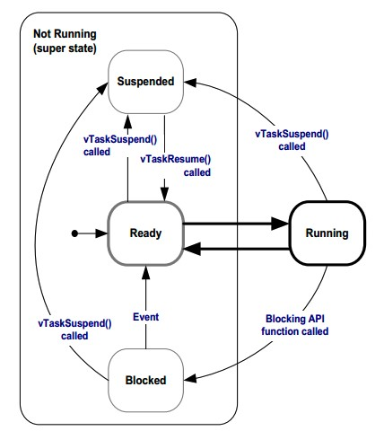
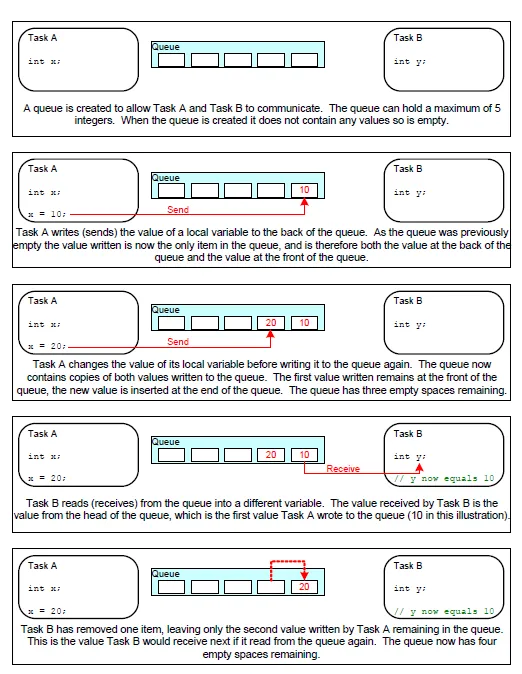
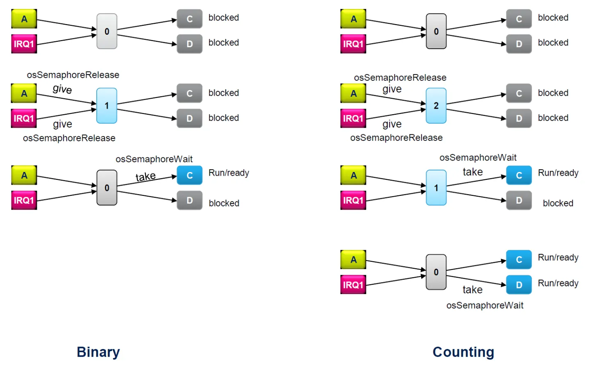

# STM32 HAL / RTOS 笔记
[教程](https://zhuanlan.zhihu.com/p/115010977)

## 创建任务

### 启用 RTOS
1. 在 Middleware->FreeRTOS的选项卡中, 可以启用 RTOS
1. 使用 CMSIS-RTOS V2 API
1. 在 Tasks and Queues 选项卡中创建任务, 第一个默认任务不修改

### 任务属性
1. Task Name: 设置任务的名称, 它会基于此名字建立一个指向任务的句柄
1. Priority: 设置任务的优先级, 高优先级的任务会抢占低优先级的任务
1. Stack Size: 设置任务栈的大小, 用于储存任务相关的变量
1. Entry_Function: 设置任务的入口函数
1. Allocation: 设置任务所在的地方, 选择动态的话是生成在堆中, 选择静态的话则生成在静态区
1. Parameter: 传递给任务的参数
1. Code Generation Option: 设置任务函数的生成方式, 如果需要使用 C++, 则因设置为 as extern, 在外部定义任务函数

### 任务堆栈占用情况
1. 一个任务包含Stack区 (用于储存任务相关的变量) 和任务控制块TCB区 (Task Control Block, 用于储存任务本身的设置)
1. FreeRTOS Heap Usage 选项卡中, 可以查看堆栈使用情况
1. 任务占用字节数 = TCB_size + (4 x Task stack size)

### 编辑任务函数
1. CubeMX 将任务函数生成于 Src/freertos.c 中
1. 通过函数 osKernelStart() 启动 RTOS 任务调度
1. 各个线程之间耦合程度低, 日后对项目进行维护时只要对相关的线程程序进行修改就行了

## 堆与栈
### 简介
1. 栈 (stack): 由编译器自动分配和释放, 如存放函数的参数值, 局部变量的值
1. 堆 (heap): 一般由程序员分配和释放, 通过 new / delete 控制, 位于 SRAM 上

### 任务分配空间
1. 当调用 FreeRTOS 的创建任务 API 函数 xTaskCreate() 时, FreeRTOS会在堆中开辟出一块空间, 用于存放任务的控制信息 TCB 块和栈区 Stack 用于储存任务相关的变量
1. TCB 块的大小取决于 FreeRTOSConfig.h 头文件中的设置
    1. 在最小的设置下TCB块的大小是 96 字节
    1. 如果 configUSE_TASK_NOTIFICATIONS 是1的话再增加8个字节
    1. 如果 configUSE_TRACE_FACILITY 是1的话再增加8个字节
    1. 如果 configUSE_MUTEXES 是1的话再增加8个字节

### MSP 和 PSP 栈指针
#### MSP 指针
* 主堆栈指针 (Main stack pointer)
* 用于操作内核以及处理异常和中断
* 由编译器分配

#### PSP 指针
* 用于每个任务的独立的栈指针, 用于用户的任务
* 在任务调度上下文切换 (context switch) 中，PSP 会初始化为相对应的任务的栈指针，如下图所示

### 内存池分配
* 当 FreeRTOS 需要 RAM 的时候，它会调用 pvPortMalloc 这个函数而不是 malloc 这个系统函数
* 当它需要释放内存的时候，会调用 vPortFree 这个函数而不是 free 这个系统函数
* FreeRTOS 提供了五个 pvPortMalloc 和 vPortFree 的实现方案
* 可以在 CubeMX 中, FreeRTOS -> Config Parameters -> Memory Management Setting 中设置
* 由于通常的 free 与 malloc 不可使用, 在 C++ 中, 需要重载 new 与 delete, [参考](https://blog.csdn.net/qq_34269632/article/details/115618386)
*

#### 分配方案
1. Heap_1 适用于小型的嵌入式系统
只能在调度器启动之前创建任务和其它内核对象, 之后任务的内存分配在程序的运行周期中保持不变并且无法被释放
1. Heap_2 FreeRTOS 向旧版本兼容的方案
不推荐使用
1. Heap_3 基于标准库
使用标准库里的 malloc 和 free 函数，所以堆的大小由链接器配置决定, 使用场景不多
1. Heap_4 适用于通用的应用, 也是默认应用
由一个数组表示堆, 并把数组分割成小的内存块, 堆的大小由 configTOTAL_HEAP_SIZE 定义
1. Heap_5 类似于Heap_4
Heap_5 可以用不同的数组空间对内存进行分配, 使用 vPortDefineHeapRegions 函数指定额外空间

### 内存管理函数
1. size_t xPortGetFreeHeapSize(void);
获取堆中的剩余空间
1. size_t xPortGetMinimumEverFreeHeapSize(void);
获取堆的最小剩余空间, 可根据此设置堆大小, 只能在 Heap_4 或者 Heap_5 下调用
1. void vApplicationMallocFailedHook(void);
需要用户实现的回调函数, 在内存获取失败时调用

## 任务管理
### 任务
在FreeRTOS中, 线程 (Thread) 和任务 (Task) 的概念是相同的, 每个任务就是一个线程

### 任务基本模式
```cpp
void TaskFunction( void *pvParameters )
{
    for(;;)
    {
    }
    vTaskDelete(NULL);  
}
```
* 这个任务函数不能有返回值 (即使用return语句), 不然会导致异常
* 如果不需要这个任务的话, 必须要用语句显示地删除这个任务 (比如调用vTaskDelete()这个函数)
* 任务具有以下状态
    1. 就绪状态 (Ready)
    当任务没有被阻塞或者挂起等待运行的时候处于此状态
    1. 运行状态 (Running)
    当任务被内核调度执行的时候处于此状态
    1. 阻塞状态 (Blocked)
    当任务等待某个事件或信号的时候处于此状态
    1. 挂起状态 (Suspended)
    当任务被 vTaskSuspend() 函数禁止运行的时候处于此状态


### 任务的优先级
* 任务的优先级可以用 vTaskPrioritySet() 函数设置 
* FreeRTOSConfig.h 头文件中的 configMAX_PRIORITIES 可以设置最高优先级的值
* 在 FreeRTOS->Tasks and Queues 中可以单独设置任务的优先级

### 任务的创建
任务由 FreeRTOS 中 xTaskCreate() 函数创建
```cpp
BaseType_t xTaskCreate( TaskFunction_t pvTaskCode,
                        const char * const pcName,
                        uint16_t usStackDepth,
                        void *pvParameters,
                        UBaseType_t uxPriority,
                        TaskHandle_t *pxCreatedTask );
```
1. pvTaskCode
一个函数指针, 指向执行任务的函数
1. pcName 
任务的描述名称, 方便调试, 不用的话可以设为 Null
1. usStackDepth
每个任务有自己的栈空间, 这里根据任务占用需求设置栈空间的大小, 单位是字 (Word)
1. pvParameters
用于传递给任务的参数, 不用的话可以设为Null
1. uxPriority
设置任务的优先级, 范围由 0 到 (configMAX_PRIORITIES – 1)。数值越大, 等级越高
1. pxCreatedTask
任务的句柄
1. 函数的返回值
    1. pdPass表示任务创建成功
    1. pdFail表示创建失败
* 每执行 xTaskCreate() 创建一个任务便会在堆空间中开辟一个TCB块和一个存放数据的Stack栈区
* STM32CubeIDE 中, 负责创建任务的函数是 osThreadNew()

### 调度器
* FreeRTOS 中采用了 round-robin 的调度算法, 包含抢占式 (preemptive) 和合作式 (cooperative) 两种模式
* 模式的选择在 FreeRTOSConfig.h 中由参数 configUSE_PREEMPTION 决定

#### 抢占式模式
在抢占式模式下, 在每次调度器运行时, 高优先级的任务会被切换优先执行, 当前处于运行状态的低优先级的任务则会立刻进入就绪状态等待运行

#### 合作式模式
在合作式模式下, 高优先级任务不会抢占当前正在运行状态的低优先级任务, 直到低优先级任务进入以下状态才会切换任务
1. 完成进入阻塞状态 (比如调用 osDelay() 函数)
1. 就绪状态 (比如调用 osThreadYield() 函数)
1. 被系统置于挂起状态后

#### 抢占式无时间片调度
* 需要设置 configUSE_TIME_SLICING 以关闭时间片
* 这种调度方式下, 因为没有采取时间片, 所以调度器的执行开销会比较小
* 在抢占式无时间片调度下, 当前运行的任务会一直运行, 直到它进入阻塞或者挂起状态, 另一个相同优先级的任务才会运行

### 任务的调度
* FreeRTOS 对任务的调度采用基于时间片 (time slicing) 的方式
* 即把一段时间等分成了很多个时间段, 在每个时间片结束后, 进入内核调度任务, 保证优先级最高的任务能执行或使相同优先级的轮流使用每个时间段占用 CPU 资源
* 时间片的大小由参数 configTICK_RATE_HZ 设置
* 因此, 在 FreeRTOS 内时间的最小单位是一个节拍 (tick), 延时函数 vTaskDelayUntil 和 vTaskDelay 的参数需要的是延时的节拍数, 不能直接设置延时时间
* 可以使用函数 pdMS_TO_TICKS() 将时间转为节拍数

### 空闲任务
* 空闲任务是调度器在 vTaskStartScheduler 函数调用启动后自动创建的一个任务
* 空闲任务具有最低的优先级0, 当用户创建的任务都在阻塞状态或挂起状态时, 空闲任务便得以执行
* 最低的优先级确保空闲任务不会抢占用户任务, 同时空闲任务负责清理内核的资源
* 空闲任务可以绑定一个钩子任务 (Task Hook), 当空闲任务运行的时候钩子任务也会被自动调用
* 钩子任务的函数原型是 vApplicationIdleHook( void ), 可以由用户定义

## 队列管理


### 全局变量和弊端
* 使用全局变量将导致线程不安全, 一种解决这个问题的方案就是采用队列
* 队列提供了一种任务间或者任务和中断间的通讯机制

### 队列
* 队列是先进先出 FIFO (First In First Out), 先进先出表示的是先写入的数据会先被读取
* 队列中的数据必须是相同类型的, 可以是基本类型也可以是结构体
* FreeRTOS 采用是复制队列的实现方式, 即写入队列的数据每个字节都被完整复制到队列, 不通过引用方式保存
* 如果使用指针管理队列, 可能指针的资源已被销毁, 但留在队列中导致错误
* 当一个任务试图从队列读取数据的时候, 它可以设置一个阻塞时间 (block time), 这是当队列数据为空时, 任务处于阻塞状态的时间, 当有数据在队列或者到达阻塞时间的时候，任务都会进入就绪状态
* ==将队列定义为全局变量, 各个任务通过队列传输数据==

### 队列操作方法
#### 创建队列
```cpp
QueueHandle_t xQueueCreate(
    UBaseType_t uxQueueLength, UBaseType_t uxItemSize)
```
* uxQueueLength
队列包含数据的最大长度
* uxItemSize
每个数据占用的字节大小
* 函数返回值
    * QueueHandle_t 句柄类型, 表示的是对所创建队列的一个引用句柄
    * 没有足够的空间时, 返回 NULL

#### 发送数据
```cpp
BaseType_t xQueueSend( 
    QueueHandle_t xQueue, 
    const void * pvItemToQueue,
    TickType_t xTicksToWait )
```
* 如果要在中断程序调用的话需要使用 xQueueSendFromISR() 函数
* xQueue
队列的句柄, 来自于 xQueueCreate() 的返回值
* pvItemToQueue
所发送数据的引用, 然后这些数据会被复制到队列中
* xTicksToWait
队列如果满时发送任务的阻塞时间, 单位为时间片节拍数, 如果设置为 portMAX_DELAY 的话任务将永远等待下去
* 返回值
发送数据成功时返回 pdPASS, 失败时返回 errQUEUE_FULL

#### 读取数据
```cpp
BaseType_t xQueueReceive( 
    QueueHandle_t xQueue, 
    void * const pvBuffer,
    TickType_t xTicksToWait )
```
* xQueue
队列的具柄
* pvBuffer 
指向内存空间的一个引用, 读取的数据会被复制到这片内存
* xTicksToWait 
队列如果空时接送任务的阻塞时间
* 返回值
发送数据成功时返回 pdPASS, 失败时返回 errQUEUE_FULL

#### 获取队列中的数据
```cpp
UBaseType_t uxQueueMessagesWaiting( 
    QueueHandle_t xQueue )
```

#### CMSIS RTOS 的封装
1. 创建队列
osMessageQueueNew
1. 获取信息
    * osMessageQueueGet
    * 当 timeout 为 0 时允许从中断函数调用
1. 插入信息
    * osMessageQueuePut
    * 当 timeout 为 0 时允许从中断函数调用
1. [其他参考](https://blog.csdn.net/RootCode/article/details/106801936)

### 实例
1. 使用任务 1 检测扫描键盘输入, 使用任务 2 将键盘输入转为串口输出
1. 键盘输入共有四种信息, 其中键盘持续按下与持续松开的信息占主要
1. 如果把每次信息均插入队列, 这要求处理部分的处理速度更快, 否则队列将爆满
1. 由于按下与松开的信息并不是主要信息, 并且, 因此可以忽略, 只发送点击与释放的信息
1. 忽略这些信息后, 即保证了处理部分的速度可以慢于获取部分, 也避免了对无用信息的处理
1. 为了保证能够快速处理任务, 因此可以使用永久阻塞等待消息 (osWaitForever), 减少调度的消耗

## 软件定时器

## 资源管理
### 数据同步与信号量

* 信号量不是一个具体的值, 而是一种多任务同步机制
* 等待 (Take) 信号量的任务会阻塞, 直到有任务给出 (Give) 信号量
* 不同于回调, 信号量机制可以保证每个任务相互独立与任务之间正常调度
* 可通过各个任务等待上一个信号量与给出下一个信号量, 规定各个任务的调度顺序
* 与消息队列相同, 信号量应作为全局变量使用

### 二进制信号量
* 二进制信号量中信号量的数目最多为 1
* 二进制信号量无论同时给出多少次, 只能被读取一次
* 因此当资源给出的频率较快时, 不应当使用二进制信号量, 否则可能导致资源丢失

### 计数信号量
* 计数信号量可以被多次读取与给出

### 资源保护与互斥量
* 互斥量不是一个具体的值, 而是一种资源保护机制
* 由于任务调度机制, 当任务 A 使用资源时, 调度到同样使用此资源的任务 B 将导致混乱, 需要引入互斥量
* 在使用特定资源前, 先等待管理这个资源的互斥量, 确保这个资源不被其他任务使用
* 在使用结束后再给出互斥量, 使这个资源能够被使用
* 互斥量不能在中断中操作

### FreeRTOS 信号量函数
FreeRTOS 中, 三种信号量的操作函数相同

#### 创建二进制信号量
```cpp
SemaphoreHandle_t xSemaphoreCreateBinary(void)
```

#### 创建计数信号量
```cpp
SemaphoreHandle_t xSemaphoreCreateCounting(
     UBaseType_t uxMaxCount,
    UBaseType_t uxInitialCount );
```
* uxMaxCount 
计数信号量包含信号量的最大值
* uxInitialCount 
计数信号量中信号量的初始值

#### 创建互斥量
```cpp
SemaphoreHandle_t xSemaphoreCreateMutex( void )
```

#### 等待信号量
```cpp
BaseType_t xSemaphoreTake( 
    SemaphoreHandle_t xSemaphore, 
    TickType_t xTicksToWait )
```
* xSemaphore 
信号量的句柄
* xTicksToWait 
如果信号量不可用的话任务处于阻塞状态的最长时间, 设置为  portMAX_DELAY 的话任务会一直处于阻塞状态直到信号量可用, 设置为 0 的话如果信号量不可用的话会直接返回
* 返回值
pdPASS 表示成功获取了信号量, 返回值为 pdFALSE 表示获取信号量失败

#### 给出信号量
```cpp
BaseType_t xSemaphoreGive( 
    SemaphoreHandle_t xSemaphore );
```
* xSemaphore 
信号量的句柄
* 返回值
pdPASS 表示成功给予信号量, 返回值为 pdFALSE 表示给予信号量失败

#### 在中断中给出信号量
```cpp
BaseType_t xSemaphoreGiveFromISR( 
    SemaphoreHandle_t xSemaphore,
    BaseType_t *pxHigherPriorityTaskWoken) 
```
* pxHigherPriorityTaskWoken
可以使用值 pdFALSE / pdTrue, 但要通过指针的形式给出, pdTRUE 时, 离开中断时, 如果有高优先级的任务因此解除阻塞, 则将优先执行此任务

### CMSIS RTOS 信号量操作函数
#### 互斥量部分
##### 创建互斥量
```cpp
osMutexId_t osMutexNew (const osMutexAttr_t * attr)	
```
* attr
互斥量属性, 对于一般使用 NULL 即可

##### 等待互斥量
```cpp
osStatus_t osMutexAcquire(
    osMutexId_t mutex_id, uint32_t timeout)	
```

##### 给出互斥量
```cpp
osStatus_t osMutexRelease(osMutexId_t mutex_id)	
```

##### 获取互斥量的来源
```cpp
osThreadId_t osMutexGetOwner(osMutexId_t mutex_id)	
```

#### 信号量部分
默认创建的是计数信号量


### 关键区
* 另一种资源管理方法, 在关键区内, 任务不能被调度, 必须完整执行关键区内的内容

#### 进入关键区
```cpp
taskENTER_CRITICAL()
```

#### 离开关键区
```cpp
taskEXIT_CRITICAL()
```

## 中断管理
### FreeRTOS的中断管理
* FreeRTOS对于中断没有特别的处理程序
* 对于大部分内核函数==不能==在中断内调用, 或者要调用中断版本 XXXFromISR (如果是 CMSIS RTOS, 可以调用部分函数, 但参数有限制)
* 即使是拥有最小优先级的中断也会打断拥有最高优先级的任务

### 延迟中断处理
* 在竞争调度模式下, 小优先级任务进入中断后, 离开中断时, 是否继续执行小优先级任务需要使用函数 portYIELD_FROM_ISR(BaseType_t xHigherPriorityTaskWoken) 决定 (参数 pdFALSE 时不发生切换)
* 中断会打断内核, 当中断持续时间过长或调用内核函数, 将导致系统不稳定, 通过延迟中断, 将控制权移交回内核, 可以让程序更加稳定

1. 可以将中断处理任务定为最高优先级的任务, 并使用信号量阻塞
1. 在中断函数中, 清除中断标志后, 给出信号量, 并使用 portYIELD_FROM_ISR, 进入处理任务

## 调试选项
在正式 Release 时关闭
1. RECORD_STACK_HIGH_ADDRESS
1. GENERATE_RUN_TIME_STATS
1. USE_STATS_FORMATTING_FUNCTIONS

## 参考资料
* [CMSIS RTOS](https://arm-software.github.io/CMSIS_5/RTOS2/html/rtos_api2.html)
* [Free RTOS](https://www.freertos.org/zh-cn-cmn-s/Documentation/RTOS_book.html)
