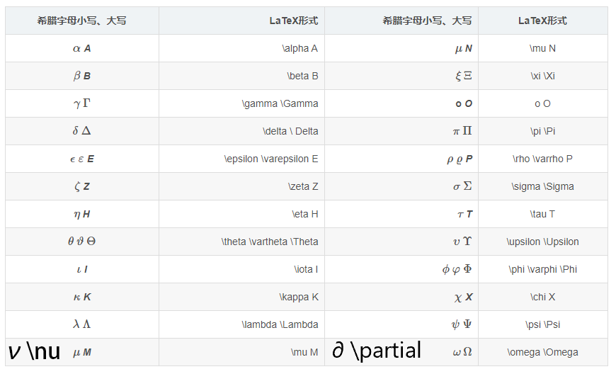
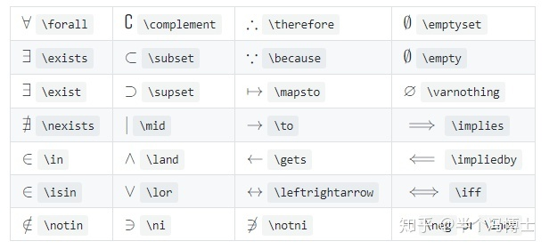
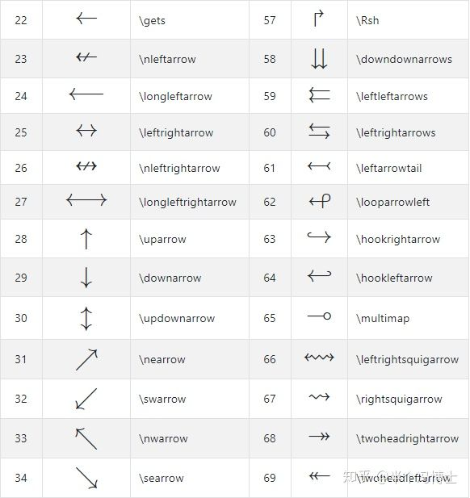

# Latex
## 在markdown中使用latex
* 行内排版 使用一个\$将内容包括
eg. $c=\sqrt{a^{2}+b_{xy}^{2}+e^{x}}$
* 块级排版 使用两个\$
eg. 
$$ c = \sqrt{a^{2}+b_{xy}^{2} +e^{x}} $$
## 基本规则
### 转义
* \# \$ \% \& \~ \_ \^ \\ \{ \}有特殊意义，需要表示这些字符时，需要转义，即在每个字符前加上 \\ 。
### 空格
* \quad 表示公式中的空格(一个字符)(默认无空格)
* \qquad 表示大空格(两个字符)
* \\\\ 表示换行
* \\: 表示中空格(小于一个字符，包括下方)
* \\; 表示中大空格
* \\, 表示小空格
* \\! 缩进空格

eg. 
$$!a\!b\\ ,a\, b \\ :a\: b \\ ;a\; b \\ a\quad b \\ a\qquad b$$
### 空行
使用 \viskp\baselineskip 
### 希腊字母

### 花体字母
\mathscr{ABCDEFGHIJKLMNOPQRSTUVWXYZ}

$\mathscr{ABCDEFGHIJKLMNOPQRSTUVWXYZ}$

### 多个字符
当公式中有多个字符时需要使用{}将公式括起
使用符号时均使用 \\[符号]{内容} 的格式
## 符号表示
### 根号
* \sqrt 表示根号
* \sqrt[开方次数] 表示多次根号
eg. $\sqrt[2]{x^2+y^2}$
### 分数
* 通常使用 \frac{分数上方}{分数下方} 表示
* \dfrac 分数大小为独立公式的大小
* \tfrac 分数大小为行间公式的大小
eg. $frac=\frac{1}{2}\quad dfrac=\dfrac{1}{2}\quad tfrac=\tfrac{1}{2}$
### 上下标
* 用^来表示上标
* 用_来表示下标
eg. $C_3^2$
### 运算符
#### 普通运算符
* \+ \- \* \/ \= 直接输入
#### 集合
* 集合字母 \mathbb{R}
* \subset ⊂
* \subseteq ⊆
* \supset ⊃
* \in ∈
* \cap ∩
* \cup ∪
* \mid ∣
* \notin ∉
.eg $n\in\mathbb{R}$
#### 命题
* \forall 任一
* \exists 存在
eg. 
$$\forall\varepsilon>0,\exists \delta > 0,\forall x\in \mathring{N}(a,\delta):|f(x) - l| > \varepsilon$$  

#### 箭头

`\xrightarrow[下方公式]{上方公式}` $\xrightarrow[上方公式]{下方公式}$

顺时针表示 `\curvearrowright` $\curvearrowright$
逆时针表示 `\curvearrowleft` $\curvearrowleft$

#### 特殊运算符
特殊运算则用以下特殊命令\pm\; \times\; \div\; \cdot\; \cap\; \cup\; \geq\; \leq\; \neq\; \approx\; \equiv

eg. $\pm\; \times\; \div\; \cdot\; \cap\; \cup\; \geq\; \leq\; \neq\; \approx\; \equiv$

* 无穷大 \infty $\infty$
* 正相关 \propto $\propto$
* 波浪线(相似) \sim $\sim$
* 远大于 \gg $\gg$
* 远小于 \ll $\ll$
* 点乘 \cdot $\cdot$
* 哈密尔顿算子 \nabla $\nabla$
* 连接 \bowtie $\bowtie$
* 垂直 \perp $\perp$
* 平行 \parallel $\parallel$
* 左连接 ⟕ (直接输入)
* 右连接 ⟖ (直接输入)
* 外连接 ⟗ (直接输入)
* 垂直省略号 \vdots $\vdots$

[参考](https://blog.csdn.net/Ying_Xu/article/details/51240291)
### 大型运算符
运算符上下标使用^与_ ，在块级显示中才会按普通规则显示
#### 求和
使用 \sum eg. $\sum_{i=1}^{n}x_i$

eg. 
$$\sum_{i=1}^{n}x_i$$
#### 累积
使用 \prod eg. $\prod_{i=1}^{n}x_i$
#### 极限
使用\lim eg. $\lim_{x\to0}\frac{x}{sinx}$

eg. 
$$\lim_{x\to0}\frac{x}{sinx}$$
#### 积分
使用 \int eg. $\int_a^bxdx$

eg. 
$$\int_a^bxdx$$
#### 多重积分
使用\iint , \iiint eg. $\iiint$
#### 环路积分
使用 \oint \oiint eg. $\oint$

#### 变量取值
使用 \bigg|_{...}

eg. 
$$\frac{dy}{dx}\bigg|_{x=1}$$

### 常用标注
* 向量\vec
eg. $\vec{x}$
* 尖帽\hat
eg. $\hat{x}$
* 平均值\bar
eg. $\bar{x}$
* 去心邻域
eg. $\mathring{N}$
* 横线
eg. $\overline{ABC}$
* 长箭头
eg. $\overrightarrow{ABC}$
* 圆弧
eg. $\overgroup{AB}$
* 相量\dot
eg. $\dot{U}$
### 括号
* () [] {} || [] 直接使用
* 在括号前加上\big \Big \bigg \Bigg 调整大小，两侧都要有该符号

eg. 
$$\Bigg( \bigg( \Big( \big((x) \big) \Big) \bigg) \Bigg)$$

* 特殊括号 \langle \rangle \lvert \rvert \lVert \rVert
$$\langle X \rangle\quad\lvert X \rvert\quad\lVert X\rVert$$
### 省略号
* 省略号用 \dots \cdots \vdots \ddots表示 ，\dots和\cdots的纵向位置不同

eg. 
$$ x_1, x_2, \dots, x_n\quad 1,2,\cdots,n\quad \vdots\quad \ddots $$
### 复杂公式
* 基本格式 \begin{样式} ..内容.. \end
* & 分隔列 \\\\ 分隔行
#### 矩阵

eg.
$$
\begin{pmatrix} 
a & b & e\\ 
c & d & f\\
\end{pmatrix}
\begin{bmatrix} 
a & b \\ 
c & d \\
\end{bmatrix}
\begin{Bmatrix} 
a & b \\ 
c & d \\
\end{Bmatrix}
\begin{vmatrix} 
a & b \\ 
c & d \\
\end{vmatrix}
\begin{Vmatrix} 
a & b \\ 
c & d \\
\end{Vmatrix}
\begin{smallmatrix} 
a & b \\ 
c & d 
\end{smallmatrix}
$$
##### 矩阵格式
1. \cdots 是横向的居中的省略号
1. \vdots 是竖向的省略号
1. \ddots 是对角线方向的省略号
1. \ldots  是跟文本底线对齐的省略号
1. & 对齐矩阵中的元素
1. 使用 \\ 为矩阵换行

#### 长公式
* 无需对齐可使用gathered
* 需要对齐使用aligned
* 用\\\\来分行
* 用&设置对齐的位置

eg. aligned 
$$
\begin{aligned}
    x &= 12 + 14 + 2 \\
    x &= 26 + 2 \\
    x &= 28
\end{aligned}
$$
eg. gathered
$$
\begin{gathered}
    x = 12 + 14 + 2 \\
    x = 26 + 2 \\
    x = 28
\end{gathered}
$$
#### 分段函数
* 分段函数使用cases

eg. $y=\begin{cases}-x&,x\leq 0\\x&,x>0\end{cases}$

## 杂项
1. 表格内不能使用块级标记
1. [在 Latex 中使用化学表达式](https://www.firprin.com/mhchem/)
1. [Latex 数学符号参考](https://www.firprin.com/latex/)
