# Typst 笔记
## 基本介绍
Typst 为一种为科学写作诞生的标记与排版系统  
通过 `.typ` 文件编写带有标记的文档, 并通过 Typst 编译器输出 PDF 文档

主要有以下方式使用 Typst
* Vscode 插件 [Typst LSP](https://marketplace.visualstudio.com/items?itemName=nvarner.typst-lsp) ([官方网页](https://myriad-dreamin.github.io/tinymist/)), 安装后即可使用
* Typst 在线编辑器 <https://typst.app/>
* Typst 命令行交互界面 <https://github.com/typst/typst/releases>

## 文档内容
### 标记模式基础语法
Typst 为常用的文档内容提供了内置的语法标记, 通过这些标记可以像 Markdown 一样快速标记内容  

#### 空格合并
Typst 与 Markdown 一样, 将连续的空格与单个换行识别为单个空格, 连续的换行识别为[段落划分](#排版标记)
* 如果希望换行参见[段落划分与强制换行](#排版标记)
* 如果希望表示一定长度的空格参见[长度块](#盒子与块)

#### 注释
通过注释可为文档的标注添加说明, 注释的内容不会被解析或作为文档内容
* 单行注释
    * 使用两个正斜杠 `//` 表示单行注释
    * 注释开始直到该行结束的内容都将作为注释, 通常用于表示独占一行的注释
* 多行注释
    * 使用一对 `/* */` 包裹内容表示多行注释
    * 多行注释对内容没有要求, 可以是多行内容或单行内容, 也可以插入到一段文档中间

#### 转义
通过反斜杠 `\` 可以引出一个转义符号, 通常有两种用法
* `\u{XXXX}` 通过在 `XXXX` 给出 16 进制的编码表示特定的 Unicode 字符
* `\x` 通过给出任意字符 `x`, 转义将保证该字符以原本的形式输出而不会作为标记被解析, 可用于表示标记字符, 如 `\#`, `\\` 等

### 基本元素
参考自 <https://sitandr.github.io/typst-examples-book/book/basics/must_know/index.html>

#### 长度与间隔
在 Typst 中, 通过数字与单位的组合表示长度类型的值, 常用的长度单位有
* `em` 相对文本基准字体大小倍数的长度
* `pt` 设备物理像素长度
* `in, mm, cm` 英尺, 毫米, 厘米

除了以上长度, 还有基于布局的相对长度单位 (类型不是长度, 但在布局中一般可视为长度使用)
* `%` 相对==元素所在**块**空间==的百分比长度
    * [百分比](#简单值的表示)类型的值在不同场景下有不同含义, 此处为表示长度时的含义
    * 一般不用于表示垂直方向的长度
* `fr` 单独使用时表示所有可用布局空间, 在==同一层级==多个使用时, 表示占据==元素所在块的**可用**空间==的比例
    * 属于比例类型 [fraction](https://typst.app/docs/reference/layout/fraction/) 的值
    * 不允许与在不同的层级使用, 例如
        * `#h(1fr)#rect[#h(1fr)]` 两个比例不互通, 导致错误显示
        * `#box(width: 1fr)#box(width: 1fr)[#rect[#h(100%)]]` 正常体现为一个右侧占据行宽 50% 的矩形
长度与百分比之间还可通过 `-` 与 `+` 进行运算, 得到相对长度 [relative](https://typst.app/docs/reference/layout/relative/) 类型的值
* 长度 `lenght` 与百分比 `ratio` 类型的值可以自动转换为该类型

通过以下函数创建间隔
* 函数 `h(amount)` 表示创建一个水平间隔
    * `amount: relative | fraction` 表示间隔长度
* 函数 `v(amount: relative | fraction)` 表示创建一个垂直间隔
    * `amount: relative | fraction` 表示间隔长度
    * 创建垂直间隔的同时将强制进行一次[段落划分](#排版标记)

#### 盒子与块
在 Typst 中
* 盒子用于表示==位于行内==的, 具有特定大小的文档内容
    * 不同的盒子可以在同一行或同一段之间混合排列
    * 定义**行内**文档内容, 其底层为一个盒子
* 块用于表示位于==单独一段==的, 具有特定大小的文档内容
    * 每个块都将独立占据一个段落
    * 定义**块级**文档内容, 其底层为一个块
* 整个文档页面也是一个块, 文档的内容为页面下的盒子或块

以下参数可直接用于创建盒子与块
* 函数 `box(width, height, fill, stroke, radius, inset, outset)[body]` 创建一个盒子
    * `width: relative | fraction` 盒子宽度, 注意可以使用[比例](#长度与间隔), 可自动包裹内容
    * `height: relative` 盒子高度, 可自动包裹内容
    * `fill: color | none` 盒子填充颜色, 参数为[颜色值](#样式值的表示), 默认无填充
    * `stroke: stroke | none` 盒子线条样式, 传入[线条样式](#样式值的表示), 默认无边框
    * `radius: relative` 边框圆角大小, 默认无圆角
    * `inset, outset: relative` 内外边距, 默认为 `0`, 即与内容紧贴
    * ==可使用函数 [rect](https://typst.app/docs/reference/visualize/rect/) 快捷创建带有边距与边框的盒子==
    * 通过盒子包裹, 可强制将[图片](#图片与表格)等块级文档内容转换为盒子, 从而在行内显示
* 函数 `block(width, height, fill, stroke, radius)[body]` 创建一个块
    * `width, height: relative` 块的宽度与高度, 不会随内容调整
    * `fill, stroke, radius` 与盒子的参数类似
    * 一般不会直接使用块, 如果希望创建一个浮动框, 可参见[图表容器](#图表容器)

#### 内容控制
Typst 中使用 [alignment](https://typst.app/docs/reference/layout/alignment/) 类型的值表示对齐样式
* 通过关键字表示单个方向的对齐, 常用的有
    * `start, end` 向行首 / 行尾对齐
    * `right, center, left` 向右, 中, 左侧的水平对齐
    * `top, horizon, bottom` 向上, 中, 下侧垂直对齐
    * 通过 `+` 可组合两个方向的对齐

函数 `place(alignment, *, dx, dy)[body]` 设置给定文档内容的位置
* `alignment: alignment` 相对函数返回内容所在块的对齐位置
    * 整个文档页面为一个块, 因此在文档内直接调用此函数时将相对页面对齐
* `dx, dy: relative` 在原始对齐位置上的偏移

使用以下代码为例
```typst
// 创建一段空间
#block(width: 100%, height: 5em)[]

// 块内设置位置, 将相对块对齐
#block(width: 60%, height: 5em, stroke: red)[#place(right + top)[#rect[from box]]]

// 文档内容设置位置, 将相对整个文档对齐
#lorem(30) #place(right + top)[#rect[from text in document]]

// 通过块实现居中显示内容的效果 (实际一般使用图表容器 figure)
#block(width: 100%, height: 2em)[#place(center)[#rect[Text in the center block]]]

#lorem(30) #place(right + top)[#rect[from text in document]]
```

有效果
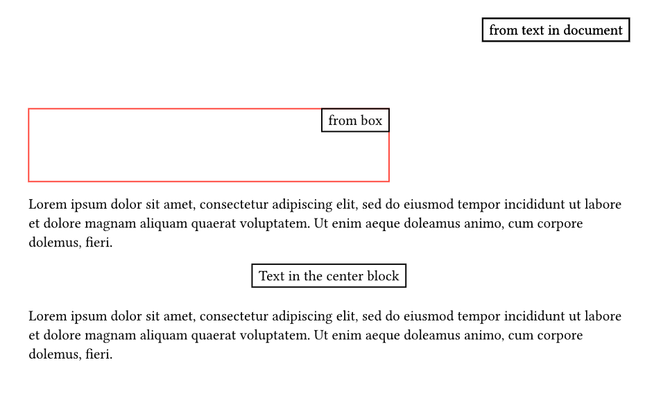

函数 `scale(x: ratio, y: ratio, origin: alignment)[body]` 拉伸内容
* `x, y` 拉伸比率, 传入[百分比](#简单值的表示), 可以是负数表示反转
* `origin` 变换中心, 默认为内容中心

#### 网格
网格本身为一个块级元素, 同时网格内的各个单元也视为块, 通过网格可实现对多个文档内容的简单布局

函数 `grid(columns, rows, gutter, align)[...children]` 创建网格
* `columns, rows: int, array` 网格的列与行设置
    * 如果传入整数, 表示列或行数
    * 如果传入[数组](#简单值的表示), 数组的各个元素表示对应列或行的宽度, 元素值可以是
        * `auto` 自动确定
        * `relative` 使用给定[绝对或相对长度](#长度与间隔)
        * `fraction` 按比例占据剩余空间
* `gutter: relative` 网格间间隔
* `align: alignment` 单元内容的对齐方式 
* `children` 网格内容
    * 该参数为变长参数, 将按从左到右, 从上到下的顺序作为单元内容
    * 网格的每一个单元都是一个有大小的块
* 对于跨行网格等复杂网格, 参见第三方模块提供的 [gridx](#创建表格)

网格一般用于多图片布局, 例如以下示例代码
```typst
#figure(
  grid(columns: 2, rows: 4, gutter: 1em, 
    image("src/log.drawio.png"), 
    image("src/sin.drawio.png"), 
    [(a) log], [(b) sin], 
    image("src/tan.drawio.png"), 
    image("src/sinh.drawio.png"), 
    [(c) tan], [(d) sinh]), 
  caption: [Figure of four function]
)
```

以上代码有效果
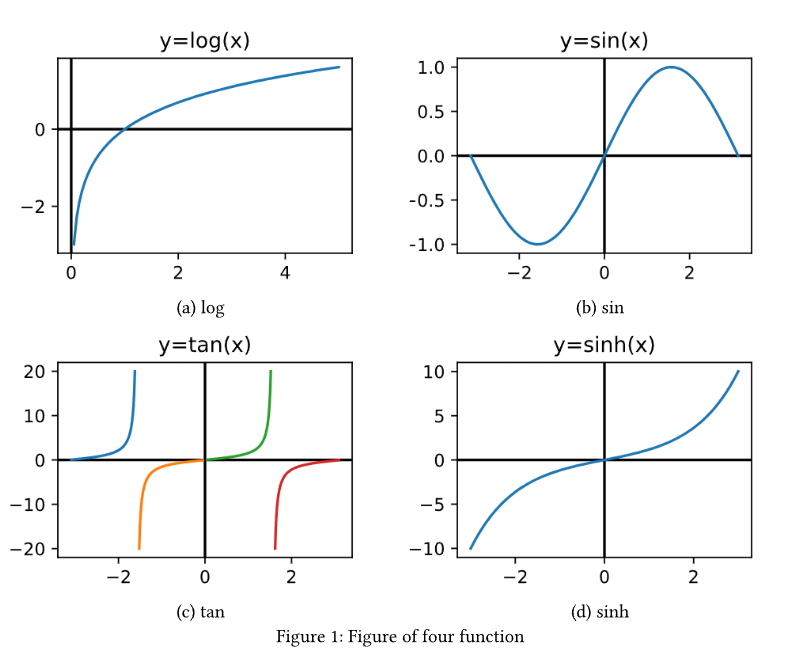

### 图片
#### 创建图片
函数 `image(path, *, width, height, fit)` 插入图片
* `path: string` 图片路径, 支持 `png, jpg, gif, svg`
* `width, height: relative` 图片占用空间大小
* `fit: str` 如何处理图片与占用空间不匹配, 通过以下==字符串==表示
    * `cover` 通过裁剪图片以适应可用空间 (默认)
    * `contain` 图片未占用的空间留白处理
    * `stretch` 拉伸图片以适应可用空间
* 创建的图片为块级元素, 可通过 `#box(image(...))` 实现行内插入图片
* 多个图片可通过[网格](#网格)布局展示
* 对于一般图片, 建议使用[图表容器](#图表容器)包裹

#### 图表容器
在 Typst 中, 创建了一个[图片](#图片), [表格](#表格), [代码段](#代码段)或自定义框时, 只是一个单纯的块  
建议使用图表容器来包裹这些块, 在包裹的同时能够
* 根据给定标题, 自动生成编号标题, 并优化引用名称, 使其满足论文对图标的使用要求
* 居中放置被包裹内容

函数 `figure(body, *, caption, kind)` 创建图表容器
* `body: content` 图表容器内容, 对内容没有限制
* `caption: content` 图表标题
    * 函数 `figure.caption(position, body)` 用于生成标题, 可通过 [Set 规则](#set-规则) 修改标题位置, 具体见例子
* `gap: length` 图表标题与内容的距离
* `kind: auto | str | any` 图表类型标识, 对于相同的图表将使用同一个计数器
    * 默认能自动识别内置类型, 一般仅自定义的图表类型需要传入该参数
    * 有内置类型 `image` [图片](#图片), `tables` [表格](#表格), `raw` [代码段](#代码段)
    * 注意内置类型的 `kind` 参数都是==直接传入对应函数名称, 而不是字符串==, 具体见下方例子
* `supplement: content` 图表类型名, 用于显示在标题与引用上的名称
    * 对于自定义类型或修改原有名称, 一般通过 [Shwo 规则](#show-规则)为其确定名称, 具体见例子
* `numbering: str` 图标编号模式
    * 具体设置方法参见[标题与目录](#标题与目录)
    * 如果要让图表按章节划分编号, 可参见包 [i-figured](https://github.com/RubixDev/typst-i-figured)
* 图表容器除了包含图片等, 还可用于包含浮动栏等自定义的文档内容

例如以下示例代码
```typst
// 修改表格图表的的类型名
#show figure.where(kind: table): set figure(supplement: "表")
// 修改表格标题的对齐, 默认为向下对齐
#show figure.where(kind: table): set figure.caption(position: top)

#figure(
    caption: "greet",
    kind: table
// 通常在图表容器后紧接标签, 以标记图表
)[#rect()[This is tables]] <tab:test> 

////

// 创建自定义类型, 通过选择该类型的图表容器, 实现类型名的确定
#show figure.where(kind: "box"): set figure(supplement: "Box")

#figure(
    caption: "greet",
    kind: "box"
)[#rect()[Hello @tab:test]]
```

有运行效果
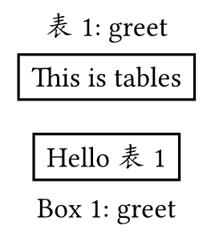

图表容器也可用于包含自定义浮动栏, 例如以下代码
```typst
#lorem(40)
#figure[
    #rect(width: 60%, fill: luma(80%))[
        *Equation:* #lorem(12)

        $ x = (-b plus.minus sqrt(a^2-4a c)) /(2a) $
    ]
] <equ:001>
#lorem(40)
```

有运行效果
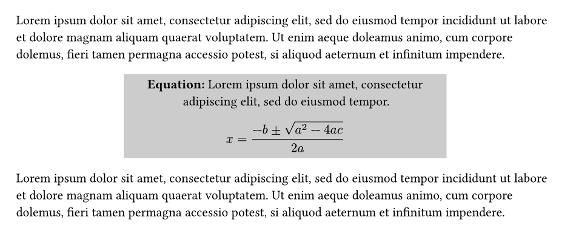

### 表格
#### 创建表格
推荐使用第三方模块 [tablex](https://github.com/PgBiel/typst-tablex) 创建表格, 本节的函数默认来自该模块, 使用前需要[导入模块](#模块导入)

函数 `tablex(columns, rows, align, repeat-header, auto-vlines, auto-hlines, auto-lines, stroke, map-cell)[...children]` 创建表格
* 基本设置
    * `columns` 表格列控制, 参数与[网格](#网格)相同
    * `rows` 表格行控制, 参数与[网格](#网格)相同, 也可根据传入内容自动确定
    * `align: alignment` 表格单元内容默认对齐方式, 参数与[网格](#网格)相同
    * `inset: relative` 表格单元内容相对表格线的内边距
    * `children: content | cellx | h/vlinex` 表格各单元内容, 参数与[网格](#网格)相同, 还可传入[特殊单元](#特殊表格单元)与[表格线](#表格线设置)
* 表格线设置
    * `auto-vlines, auto-hlines: bool` 自动绘制纵向与横向表格线, 默认为 `true`
    * `auto-lines: bool` 同时控制两个方向表格线是否自动绘制
    * `stroke: stroke` 基础表格线样式, 传入[线条样式](#样式值的表示)
    * 关于表格线更精细的控制参见表格线设置或文档
* 高级设置
    * `repeat-header: bool` 当表格被分为两页时, 是否在两页都显示表头 (表格第一行, 或第一行上跨行单元涉及的行), 默认为 `false` 
    * `map-cell: function` 单元映射控制, 参见文档 
* 通过以上参数即可创建一个具有完整表格线的表格, 此外还有函数 `gridx` 创建没有表格线的表格, 可视为网格
* 对于更复杂的样式参见文档

#### 特殊表格单元
默认情况下, 直接传入单元内容, 如果要实现特殊的跨行列单元与单元样式设置, 需要传入模块 `tablex` 中函数创建的特殊单元
* 函数 `colspanx(length, *, fill, align)[body]` 创建跨列单元
    * `length: int` 单元跨列数
    * `body` 单元内容
    * `align: alignment` 单元内容对齐方式, 默认向左上角对齐
    * `fill: color` 单元填充颜色
    * `inset: relative` 表格单元内容相对表格线的内边距
    * 跨列时, 将由跨列单元位置的单元为起点, 向右覆盖, 应当向被覆盖的单元传入 `()` 占位
    * 类似的有函数 `rowspanx` 创建跨行单元, 向下覆盖, 同样需要 `()` 占位
* 函数 `cellx(colspan, rowspan, fill, align)[body]` 创建具有指定样式的单元
    * `colspan, rowspan: int` 同时给出单元的跨行与跨列数, 默认为单个单元
    * `align, fill, inset` 单元样式, 与 `colspanx` 同
    * 该函数可用于
        * 通过参数 `colspan, rowspan` 创建跨行列单元 (覆盖位置需要使用 `()` 占位)
        * 通过参数 `x, y` 在指定位置放置单元 (对应位置需要使用 `()` 占位)
        * 通过参数 `fill, align` 仅设置单元样式
* 跨行与跨列单元能自动遮挡表格线

对于特殊单元格有如下三线表例子
```typst
#tablex(
	columns: 6, 
    // 用于双表格线
    rows: (2pt, ) + (auto, ) * 4 + (2pt, ), 
    auto-vlines: false, auto-hlines: false, 
    align: center + horizon,

    // 见下文双表格线的例子
    hlinex(),
    colspanx(6)[],
    hlinex(),

    // 跨列单元
    colspanx(2)[Symbol], [Value], colspanx(2)[Symbol], [Value],	
    hlinex(), 
    // 跨行单元
    rowspanx(3)[Damping\ $(N dot m"/"s)$], 
    [$c_(1,2)$], [35], 
    rowspanx(3)[Stiffness\ $(N dot m)$], 
    [$k_(1,2)$], [63.66], 
    (), [$c_(3,4)$], [15], (), [$k_(3,4)$], [79.57], 
    (), [$c_(5,6)$], [3], (), [$k_(5,6)$], [33.66], 

    hlinex(),
    colspanx(6)[],
    hlinex(),
)
```

以上代码效果
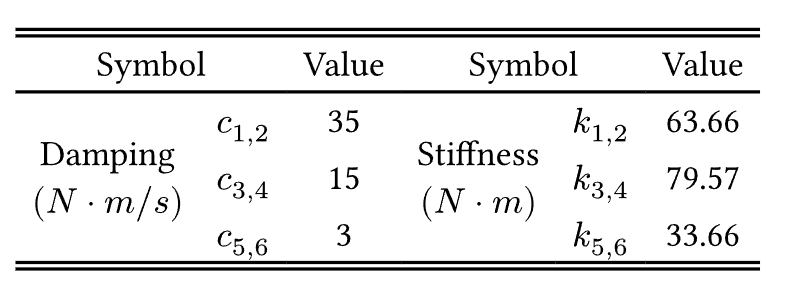

#### 表格线设置
如果需要对表格线进行更精细的控制, 需要传入表格线对象表示特定表格线
* 函数 `hlinex(stroke)` 创建水平表格线
    * `stroke: stroke | none` 水平表格线的线条样式, 或取消表格线
    * 使用时, 需要在两行的单元之间插入水平表格线
    * 如果已经存在表格线, 则将覆盖原有的表格线, 替换其样式
* 函数 `vlinex(stroke)` 创建垂直表格线
    * `stroke: stroke | none` 垂直表格线的线条样式, 或取消表格线
    * 使用时, 通常在传入内容前指定表格的各条垂直表格线, 按传入顺序从最左侧定义至最右侧的垂直表格线
* 双重表格线
    * 原生的 Typst 并不支持 Latex 中的双重表格线
    * 以横向双重表格线为例
        * 通过 `rows` 参数, 在插入双重表格线的位置设置一个指定高度的表格行
        * 使用 `rowspanx` 函数完全占据该行, 此时此行便成为一条双重表格线
        * 如果没有自动横向表格线, 需要为该行的上下添加横向表格线

对于以上表格线设置有例子
```typst
#tablex(
    columns: 3, 
    // 通过数组运算创建数组, 有双表格线的位置给出高度, 否则为 auto
    rows: (auto, ) + (2pt, ) + (auto, ) * 2, 
    auto-lines: false,

    // 设置垂直表格线
    vlinex(), vlinex(), vlinex(stroke: none), vlinex(),
    [A], [B], [C], 
        
    // 创建横向双表格线
    hlinex(),
    colspanx(3)[], 
    hlinex(),

    [a], [b], [c],
    // 设置横向表格线
    hlinex(stroke: red),
    [1], [2], [3]
)
```

以上代码效果
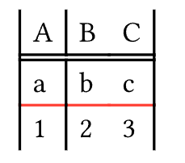

### 正式排版
主要来自 [model](https://typst-doc-cn.github.io/docs/reference/model/) 部分的函数

#### 段落与换行
函数 `par(leading, first-line-indent, hanging-indent)[body]` 创建段落
* `leading: length` 段间距, 默认为 `0.65em`
* `first-line-indent: length` 行首缩进, 默认为 `0pt`
    * 如果要实现中文排版, 可传入 `2em`
    * 该选项目前存在问题, 需要使用包 [indenta](#https://typst.app/universe/package/indenta) 修复
* `hanging-indent: length` 整段缩进
* `body` 段落内容
* 默认一段连续的文字都会使用该函数包裹, 一般仅用于 [Set 规则](#set-规则)设置

* 段落划分
    * 通过空行表示该行上下的内容为不同段落
    * 类似空格, 单个换行将被视为空格, 多个换行视为段落结束
    * 对应函数 `parbreak()`
* 强制换行
    * 通过单个 `\ ` (反斜杠加空格) 表示强制换行
    * 对应函数 `linebreak`
* 强制换页
    * 通过函数 `pagebreak()` 可强制结束当前页

#### 标题与目录
一般情况下, 可通过连续的 `=` 加上标题内容的标记表示标题, 例如 `== 二级标题`  
Typst 对标题等级没有限制, 但默认只为 3 级标题设置了样式, 因此也不建议使用更高级的标题

函数 `heading(depth, outlined, offset, numbering, supplement, level)[body]` 创建标题
* 此部分参数主要用于手动创建的特殊标题
    * `depth: int` 标题的相对等级
    * `outlined: bool` 是否将标题计入目录
* 此部分参数主要用于 [Set 规则](#set-规则)与 [Show 规则](#show-规则)设置
    * `level: int` 标题的绝对等级, 标题等级从 `1` 开始计, 主要用于 [Show 规则](#show-规则)的 `where` 选择
    * `offset: int` 标题的等级偏移, 默认为 `0`
    * `numbering: str` 标题编号模式
        * 由编号样式符与其他字符组成, 将根据标题实际编号代替编号样式符, 更多参见[文档](https://typst.app/docs/reference/model/numbering/)与[文章](https://zhuanlan.zhihu.com/p/677147856)
        * 使用 `1, a, 一, I` 表示数字, 字母, 汉字, 罗马数字编号样式
        * 一般配合 `where(level: ...)` 为各级标题确定编号方法
    * `supplement: str` 标题类型名称
        * 一般配合 `where(level: ...)` 为各级标题确定类型名称

函数 `outline(title, target, depth)` 生成目录
* `title: content` 目录标题
* `target: select` 目录对象[选择器](#样式值的表示)
    * 默认选择标题, 即 `heading.where(outline: true)`
    * 如果要为图片创建目录, 可使用如 `figure.where(kind: "image")`
* `depth: int | none` 目录深度限制, 默认为 `none`

#### 列表
Typst 中支持无序, 有序, 定义列表

* 无序列表  
    * 使用标记 `- <列表内容>` 表示一个无序列表项
    * 每个列表项占一行, 多行连续的列表项构成列表
    * 允许嵌套列表, 通过缩进表示列表间的层级
    * 对应函数 `list[..bodys]`
* 有序列表
    * 使用标记 `+ <列表内容>` 表示一个有序列表项, 其余与无序列表相同
    * 此外还可使用 `n. <列表内容>` 表示指定序号的有序列表项
    * 对应函数 `enum(numbering)[..bodys]`
        * `numbering: str` 编号方法, 参见 [heading](#标题与目录) 的同名参数
* 定义列表
    * 使用标记 `/ <定义标题>:<列表内容>` 表示定义列表项
    * 对应函数 [terms](https://typst-doc-cn.github.io/docs/reference/model/terms/) (此处不介绍)

#### 标签与链接
标签
* 通过 `<>` 包裹标签名可用于创建标签, 将自动标记标签前 (左侧) 的文档内容
* 标签名称只能包含字母, 数字, 符号 `_`, `-` 与 `:`
* 允许不同的文档内容使用同一标签, 但一般仅用于[选择器](#样式值的表示)
* 也可使用函数 `label(name, *)` 创建一个标签

标签引用
* 通过 `@<标签名>` 可对标签对应的文档内容进行超链接引用
* 也可使用函数 `ref(target, *, supplement)` 创建引用
    * `target: label` 引用的标签
    * `supplement: str | auto` 超链接名称, 对于[图表](#图表容器)与[标题](#标题与目录)可自动确定名称

链接
* 直接给出完整链接, 能自动识别为链接
* 也可使用函数 `link(dest, *)[body]` 创建链接
    * `dest: str` 链接地址
    * `body` 点击访问链接的文档内容 

#### 参考文献
函数 `bibliography(path, *, title, style)` 确定文章使用的参考文献, 并创建参考文献栏
* `path: str` 参考文献档案文件 (.bib) 路径 (关于文件编辑参见 [latex 笔记](../latex/latex_key.md#参考文献))
* `title: content` 参考文献标题
* `style: str` 参考文献格式, 常用的有
    * `ieee` IEEE 参考文献格式 (默认)
    * `gb-7714-2015-numeric` 国标参考文献格式
    * 更多参见[官方文档](https://typst.app/docs/reference/model/bibliography/#parameters-style)

对于参考文献的引用
* 使用标记 `@<引用键>` 根据参考文献档案内的标签引用
* 也可使用函数 `ref(key)` 引用参考文献
    * `key: label` 参考文献档案内的标签引用, 使用时传入同名的[标签](#标签与链接)

#### 代码段
* 通过单个 `` ` `` 包裹单行内容表示行内无渲染代码段
    * 此时将使用不转义的等宽字体显示内容  
* 通过三个及以上的 `` ` `` 包裹单行内容, 并将语言关键字与左侧边界相连, 表示行内渲染代码段
    * 此时将使用指定的语言渲染内容
    * 允许不给出语言关键字, 但内容不能与左侧边界相连, 此时可用于内容包含单个 `` ` `` 的情况  
    * 当内容包含连续的 `` ` `` 时, 保证两侧 `` ` `` 的数量多于内容即可
    * 支持的语言关键字与 Markdown 相同
* 过三个及以上的 `` ` `` 各占一行包裹多行内容, 并将语言关键字与左侧边界在同一行相连, 表示块级渲染代码段
    * 当内容包含连续的 `` ` `` 时, 保证两侧 `` ` `` 的数量多于内容即可
* 也可使用函数 [raw](https://typst.app/docs/reference/text/raw) 生成代码段
* 关于更复杂与优美的代码段显示, 可使用[第三方模块](https://typst.app/universe/package/codly)
* 可通过 [show 规则](#show-规则)与 [text](#中文支持) 函数, 例如 `#show raw: set text(font: "Source Han Mono SC")` 可设置思源等宽字体为代码块字体

例如以下代码
````typst
行内无渲染 `int main(){return 0;}`

行内渲染 ```cpp int main(){return 0;}```

块级渲染
```cpp 
int main(){
  return 0;
}
```
````

有渲染效果
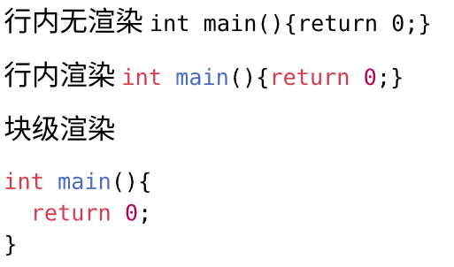

### 文字标记
主要来自 [text](https://typst-doc-cn.github.io/docs/reference/text/) 部分的函数

#### 文本标记
通过以下标记可用于表示简单的文字样式  
如果希望表示这些标记符号, 需要使用[转义](#转义)
* 加粗强调 `*strong*`
    * 默认将加粗被标记的内容
    * 对应函数 [strong](https://typst-doc-cn.github.io/docs/reference/model/strong/)
* 斜体强调 `_emphasis_`
    * 默认以斜体显示被标记的内容
    * 对应函数 [emph](https://typst-doc-cn.github.io/docs/reference/model/emph/)
* 智能引号 `'single'` 与 `"double"`
    * 能自动匹配一对引号并显示为上下引号
    * 通过[转义](#转义)可显示正常的引号

除了转义外, 其他文本标记需要通过函数创建

上下标
* 函数 `sub[body]` 下标显示内容
* 函数 `supper[body]` 上标显示内容

直线修饰
* 函数 `underline(stroke)[body]` 为内容添加下划线
    * `stroke` 下划线的[线条样式](#样式值的表示), 默认使用字体颜色
    * 类似的还有
* 函数 `overline(stroke)[body]` 为内容添加上划线
* 函数 `strike(stroke)[body]` 为内容添加删除线

其他文本标记
* 函数 `highlight(fill)[body]` 高亮文本
    * `fill` 高亮背景色, 传入[颜色样式](#样式值的表示), 默认为黄色
* 函数 `lorem(words)` 创建一段假文用于测试排版效果
    * `words` 整数, 假文的字符数

#### 文字样式
函数 `text(...)[body]` 可用于设置文档内容 `body` 的文字样式 
该函数除了设置特定内容, 由于所有文字在显示前都经过该函数包裹, 因此可以
* 结合 [Set 规则](#set-规则)以设置文档内所有文字的样式
* 将特定样式设置为[函数](#函数定义), 实现自定的文本标记

该函数参数较多, 此处仅介绍部分, 更多参见[文档](https://typst.app/docs/reference/text/text/)

* 关于斜体与字体加粗, 建议通过对应的[标记](#文本标记)实现
* `size: length` 文字大小, 传入[绝对长度值](#样式值的表示), 建议使用文字基准长度 `em` 为单位
* `fill: color` 文字颜色, 传入[颜色值](#样式值的表示)
* `lang: str` 文字主要语言, 可针对语言进行优化, 传入[语言代码](https://en.wikipedia.org/wiki/ISO_639), 如中文 `zh`
* `region: str` 文字主要地区, 可针对地区进行优化, 传入[地区代码](https://en.wikipedia.org/wiki/ISO_3166-1_alpha-2), 如中国 `cn`
* `font: str | array` 使用字体, 传入字体名称字符串, 或字体名称组成的[数组](#简单值的表示)
    * 命令 `typst fonts` 可获取 typst 在当前电脑上可使用的所有字体
    * 命令行参数 `--font-path` 可设置 typst 获取字体的路径

例如使用中文时, 应当设置
```typst
#set text(
    font: ("Times New Roman", "SimSun"), // 设置英文与中文字体 
    region: "cn", // 正确设置地区与语言
    lang: "zh"
)
```

### 文档内容杂项
#### 中文支持
参见 <https://typst-doc-cn.github.io/docs/chinese/>

中文粗体与斜体 (使用包 [cuti](https://typst.app/universe/package/cuti))
* 函数 `fakebold[body]` 为内容添加伪粗体 (用于不支持粗体的字体, 如宋体, 黑体)
* 函数 `fakeitalic[body]` 为内容添加伪斜体 (用于不支持斜体的字体, 如大部分中文字体)

段首缩进 (使用包 [identa](https://typst.app/universe/package/indenta))
```typst
#set par(first-line-indent: 2em)
#import "@preview/indenta:0.0.3": fix-indent
#show: fix-indent() // 应放置在最后
```

按章节编号, 使用包 [i-figured](https://github.com/RubixDev/typst-i-figured)

## 脚本模式
<https://typst-doc-cn.github.io/docs/reference/scripting/#methods>

### 脚本模式基础语法
Typst 通过脚本模式这一特殊的标记用于执行 Typst 表达式, 从而生成所需的内容, 因此对于复杂的文档内容通常需要通过脚本模式运行特定的表达式生成

在脚本模式下, Typst 具有类似一般编程语言的特性

#### 表达式运作
在 Typst 中, 通过 `#` 开头==无空格的紧接==一个表达式, 将表达式作为标记嵌入内容, 并使用表达式的返回值作为文档内容

为了防止表达式与空格相连影响解析可以
* 将表达式末尾与文档内容之间通过空格或换行分割
* 为了避免引入额外符号, 也可以在表达式末尾使用 `;` 结束解析

除了返回文档内容的表达式, 有的表达式则用于设置, 或包含了复杂的流程控制, 需要通过多行表式 `#{}`, 其中 `{}` 中的内容可以包含多个表达式, 且是单行 (需要 `;`) 或多行

一般通过[函数调用](#函数调用)与[变量访问](#变量访问)两种表达式获取文档内容, 更多其他表达式参见[脚本模式](#脚本模式)

#### 函数调用
Typst 的大部分标记的背后都有对应的函数, 必要时可通过函数代替标记, 从而传入更多设置  
对于复杂的内容 Typst 也提供了内置函数用于生成, 或可通过[导入包](#模板与包)解决

通过 `<函数名>(<参数1>, <参数2>)` 的方式调用函数
* 函数的参数可以是如变量访问的表达式或[值](#简单值的表示)
* Typst 函数的参数同样分为位置参数与关键字参数
    * 各个参数之间使用 `,` 分割, 允许 `()` 内的内容跨行
    * 如果函数没有参数, 依然要有空的 `()`
    * 位置参数需要首先传入
    * 关键字参数一般都有默认值可以不传入, 传入时需要使用 `<参数名>: <参数值>` 的语法 (注意 `:` 前的空格)
    * 对于部分函数, 还会存在最后有一个文档内容类型的位置参数, 这些参数可通在 `()` 外使用 `[]` 传入 
        * 如果最后的参数是可变的, 可以传入多个, 但由于多个 `[]` 间不能换行, 为了表达清晰, 建议在 `()` 内传入 (可参见例子)
        * 该语法不是强制的, ==如果内容依然来自表达式, 则可直接作为参数传入==
    * 如果函数只传入一个类型为文档内容的参数, 也可直接使用 `[]` 传入且忽略 `()`
    * 约定在笔记中使用 `fun(arg, *, kwarg)[body]` 表示函数
        * 区分开头的位置参数, 中间的关键参数与最后的文档内容参数
        * 如果 `body` 是可变的, 改用 `...body` 表示
* 特别的, 对于返回[文档内容](#简单值的表示)的函数, 在 Typst 称其为==元素==

对于以上几种函数有例子
```typst
#lorem(10) // 传入位置参数

#strong[This is strong] //直接传入单个文档内容

#enum(start: 2, 
    [A], 
    [B]
) // 传入关键字参数与末尾的多个内容参数

#par(justify: true)[
    = Background
    Lorem ipsum dolor sit amet, consectetur adipiscing elit, sed do.
] // 一种末尾传入文档内容语法的应用
```

#### 变量访问
直接给出变量名即可访问变量值, 将值作为表达式的结果

Typst 中将所有量都视为对象, 对象通过 `.` 访问成员变量或函数, 例如
* `"Hello".len()` 通过访问字符串的 `len()` 方法获取字符串长度
* `emoji.face.happy` 通过访问内置模块 `emoji` 下的 `face.happy`, 获取笑脸 emoji

Typst 中提供了以下专门用于表示符号的模块, 通过访问这些模块下的量即可将对应的符号插入文档
* [emoji](https://typst.app/docs/reference/symbols/emoji/) 用于表示表情符号
* [symbol](https://typst.app/docs/reference/symbols/sym/) 用于表示数学符号 (与模式无关, 可在标注模式下使用)

#### 简单值的表示
* 字符串 [str](https://typst-doc-cn.github.io/docs/reference/foundations/str/)  
    * 通过 `"` 包裹一段文字, 即可表示对应的字符串
    * 字符串转换为文档内容时, 将直接输出字符串内容 (不会解析其中内容)
* 布尔值 [bool](https://typst-doc-cn.github.io/docs/reference/foundations/bool/)
    * 使用 `true` 表示真, `false` 表示假
* 浮点数 [float](https://typst-doc-cn.github.io/docs/reference/foundations/float/) 与整数 [int](https://typst-doc-cn.github.io/docs/reference/foundations/int/)  
    * 通过一串数字即可表示整数, 带有 `.` 时表示浮点数
    * 加上[单位](#长度与间隔)表示长度 [length](https://typst-doc-cn.github.io/docs/reference/types/length/)
    * 加上 `%` 表示百分比例 [ratio](https://typst.app/docs/reference/layout/ratio/), 根据不同情况有不同含义
* 文档内容 [content](https://typst-doc-cn.github.io/docs/reference/foundations/content/)
    * 通过==文件块== `[]` 包裹[标记模式](#标记模式基础语法)下的文档内容即可表示其中内容对应的文档内容
    * 允许包裹跨行的文档内容
    * 通过[表达式](#表达式运作)也可用于生成文档内容
    * 注意, 文件块只能在脚本模式种使用
* 数组 [array](https://typst-doc-cn.github.io/docs/reference/foundations/array/)
    * 通过 `()` 表示数组, 其中使用 `,` 区分数组各个元素
    * 单元素的数组使用 `(xxx, )` 表示
    * 可通过 `(...) * n` 的方式快速重复数组, 可通过 `(...) + (...)` 连接两个数组
* 字典 [dictionary](https://typst.app/docs/reference/foundations/dictionary/)
    * 通过 `()` 表示字典, 其中使用 `<name>: <value>` 表示键值对, 使用 `,` 区分各个键值对
    * 键值对的键 `name` 为字符串 (但不需要引号 `"`), 值可以是任意 Typst 值
    * 可使用 `.` 运算符用于访问字典变量中特定键的值
* 空 [none](https://typst-doc-cn.github.io/docs/reference/types/none/)
    * 对于一般表达式, 无论返回什么类型的值, Typst 都会尝试将其转换为文档内容
    * 当一个表达式返回 `none` 时, 则不会产生任何文档内容
* 自动确定 [auto](https://typst-doc-cn.github.io/docs/reference/types/auto/)
    * 使用关键字 `auto` 表示
    * 表示由程序确定或使用默认值, 一般不需要指定

对于所有 Typst 类型及类对象方法参见 <https://typst-doc-cn.github.io/docs/reference/types/>

#### 样式值的表示
* 颜色样式 [color](https://typst.app/docs/reference/visualize/color/)
    * 可使用颜色关键字表示颜色, 如 `red` 或 `aqua`, 具体参见文档
    * 通过函数 `rgb(...)` 创建彩色颜色, 传入以 `#` 开头的 6 位十六进制 RGB 的字符串, 如 `rgb("#FF0000")`
    * 通过函数 `luma(...)` 创建灰度颜色, 传入[百分比例](#简单值的表示), 越大越接近白色
* 线条样式 [stroke](https://typst.app/docs/reference/visualize/stroke/)
    * 线条样式值可通过颜色样式 (线条颜色) 与长度样式 (线条宽度) 类型转换
    * 函数 `stroke(thickness, paint, dash)` 创建线条样式值 (此处仅给出部分参数, 更多见文档)
        * `thickness: length` 线条宽度, 默认为 `1pt`
        * `paint: color` 线条颜色, 默认为 `black`
        * `dash: str` 线条样式, 使用字符串表示, 常用有
            * `solid` 实线线条
            * `dotted` 点线条
            * `dashed` 虚线线条
* 相对长度样式 [relative](https://typst.app/docs/reference/layout/relative/) 与绝对长度样式 [length](https://typst.app/docs/reference/layout/length/)
    * 参见笔记[长度与间隔](#长度与间隔)
* 对齐样式 [alignment](https://typst.app/docs/reference/layout/alignment/)
    * 参见笔记[内容控制](#内容控制)
* 内容选择器 [selector](https://typst.app/docs/reference/foundations/selector/)
    * 无选择器, 将选择所有文档内容, 通常用于模板的应用或特殊的全局设置
    * 返回文档内容的函数名, 将选择该函数的返回值
        * 可使用 `<函数名>.where(<参数>: <值>)` 匹配特定参数函数的返回值  
        例如 `show heading.where(level: 1): ...` 匹配一级标题
    * [字符串](#简单值的表示), 将选择与字符串内容匹配的文档内容
        * 可使用正则表达式 `regex(<字符串>)` 匹配  
        例如 `show regex("\w+"): ...`
    * [标签](#标签与链接), 将选择被此标签修饰的文档内容
* 时间值 [datatime](https://typst.app/docs/reference/foundations/datetime/)

### 样式设置
样式设置为一类特殊的表达式, 通常用于设置文档的样式, 而不是生产文档内容

对于样式设置表达式
* 表达式的返回值为 none, 即不会产生文档内容
* 顶层的 Set 规则将一直生效, 直到文档结束
* 如果在[文件块](#简单值的表示)内调用, 则仅在文件块内生效

参考 <https://typst-doc-cn.github.io/docs/reference/styling/#show-rules>

#### Set 规则
在 Typst 中, 标记背后通过[函数调用](#函数调用)实现, 而函数中的关键字参数如果不给出将使用默认值  
因此通过修改函数关键字参数的默认值, 即可实现对特定种类标记的设置

在 Typst 中, 通过 Set 规则表达式实现对函数默认值的修改  
基本语法为 `#set <fun>(<key1>: <default1>, ...)` 
* `fun` 被设置的函数
    * 如果要设置特定标记可查找其对应的函数
    * 部分函数如 `text` 会被隐性的调用
* `key` 被设置的参数名, 一般关键字参数都能设置
    * 可查看官方文档上的说明 `可用 Set 规则`
* `default1` 设置的默认值
* 在函数部分, 基本规则与[函数调用](#函数调用)一致

例如 `#set text(font: "New Computer Modern")` 通过设置文字字体默认值, 设置文档字体样式

#### Show 规则
除了直接修改标记的参数, 还可通过其他函数包裹标记修饰原始标记的方法实现样式的设置  

在 Typst 中, 通过 Set 规则表达式实现对特定文档内容的包裹修饰  
基本语法为 `#show [select]: <exp>`  
* `select` 选择器, 参见 [selector](#样式值的表示)
* `exp` 表达式, 可以是
    * [函数调用](#函数调用), 将选择内容作为最后的内容参数传入  
        * 理论上只能使用接收单个文档内容的函数, 对于复杂函数可用 [with](#函数定义) 方法获取预定参数的封装函数
        * 例如 `#show "Notice": text.with(fill: red, size: 20pt)`
    * [Set 规则](#set-规则), 相当于规则仅对被选择的内容生效  
        * 例如 `#show strong: set text(color: blue)`
    * [匿名函数](#函数定义), 通过一个接收单个参数表示被包裹内容的匿名函数用于修饰, 可简化表达式  
        * 例如 `#show heading: it => {...; ...; ...}`

### 模块导入
模块导入为一种特殊的表达式, 通过导入模块, 可以实现文章内容的划分, 从第三方库导入实用函数或模板等

#### 模块导入表达式
子文档插入, 类似于 Latex 的子文档插入
* 子文档插入表达式为 `include "xxx.typ"`
* 该表达式将对文件 `xxx.typ` 进行解析, 并返回其中内容经过解析产生的文档内容
* 可用于插入子文档

模块导入, 类似于 Python 的模块管理
* 作为模块导入 `import "xxx.typ" [as yyy]`
    * `"xxx.typ"` 为被导入模块的路径
        * 使用本地模块时, 以当前 `typ` 文件根目录为相对路径的根目录
        * 使用[第三方模块](#第三方模块)时, 通过 `<space>/<name>:<ver>` 表示
            * `space` 模块的命名空间, 当前一般为 `@preview`
            * `name` 模块的名称
            * `ver` 模块版本
    * 该表达式将创建一个名称为 `xxx` 的模块 (与文件名相同), 其成员为文档 `xxx.typ` 内定义的函数与变量
    * 通过 `as yyy` 可以将模块重命名为 `yyy`
* 导入特定函数 `import "xxx.typ" : a1 [as b1], [a2, ...]`
    * 通过 `:` 引出从文件导入的内容
    * 直接给出 `xxx.typ` 内的函数将导入对应函数
    * 通过 `as` 可对导入的函数重命名
    * 导入多个内容时, 使用 `,` 分割

#### 模板使用
习惯上使用模板时
* 将模板中对文档的设置[封装为函数](#函数定义), 通过函数的参数传入模板的具体设置, 函数最后一个参数为原始文档内容
* 通过[模块导入](#模块导入表达式), 导入模板函数
* 通过 [Show 规则](#show-规则), 选择全文使用模板函数包裹, 模板函数则通过 [with](#函数定义) 方法传入模板设置

例如以下代码
```typst
#import "template": apply-template
#show : apply-template.with(
    title: "...",
    author: "..."
)

...
```

注意, 如果同时使用模板与[子文档](#模块导入表达式)时
* 所有子文档都要使用 `#import "template": *` 导入模板模块, 但不需要设置
* 建议在模板模块中调用其他第三方模块

#### 第三方模块
当 Typst 中已有的文档要素不满足需求或需要其他文档要素, 可先尝试使用第三方模块

* 官方第三方模块列表 
    * <https://typst.app/universe/>
* 实用中文模板与模块
    * <https://github.com/qjcg/awesome-typst/blob/main/README_ZH.md#%E6%A8%A1%E6%9D%BF%E5%92%8C%E5%BA%93>
    * 注意, 部分模板需要克隆仓库使用

以下为实用的第三方模块
* [更好的代码段](https://typst.app/universe/package/codly)
* [按章节对公式与图表编号](https://github.com/RubixDev/typst-i-figured)
* [复杂浮动栏](https://typst.app/universe/package/showybox)
* [简单卡片浮动栏](https://typst.app/universe/package/gentle-clues)

### 变量与函数定义
#### 变量定义

#### 函数定义
<https://typst-doc-cn.github.io/docs/reference/styling/#show-rules>

### 流程控制

### 数据读取与自动化文档

## 数学模式
如果希望在 Typst 中使用 Latex, 可使用第三方模块 [
mitex](https://typst.app/universe/package/mitex)

### 数学模式基础语法
数学模式是 Typst 中一种专门用于显示公式的标记, 在数学模式中的语法与 Typst 文档, 脚本模式存在不同
* 通过 `$` 包裹内容将生成公式, 以数学模式解析被包裹的内容
* 当两侧的 `$` 均不与内容相连 (如空格与==换行==) 则解析为块级数学公式, 否则解析为行内数学公式

#### 数学变量表示与引用
在数学模式下, 符号表示将具有如下特点
* 数学模式中的单个字母将使用斜体==作为变量符号显示==
    * 根据[数学模式的公式排版](#数学模式的空格换行与对齐), 通过单个字母间添加空格即可表示变量相乘
* 数学模式中的多个字母将作为脚本模式的[变量访问](#变量访问)或[函数调用](#函数调用)
    * 该语法用于简化[数学符号与标记](#数学符号与标记)
    * 如果要显示的表示对特定变量的引用, 最好见下使用 `#`
* 如果希望将多个字母强制原样显示
    * 可使用 `"` 包裹内容, 被包裹的内容将不解析地使用正体==作为文本显示== (如果是单个字母依然使用斜体)
    * 如果希望使用指定的字体参见[文本字体](#数学模式文本字体标记)
* 如果希望将单个字母访问其变量值, 即引用变量
    * 可使用 `#` 开头以脚本模式的方式调用, 对于一般变量也可使用此方式强调
    * 由于数学模式引用了 `sym` 与 `math` 模块, 为了防止冲突, 可使用 `_` 开头作为变量引用

例如以下代码
```typst
#let (_x, _y) = (1, 2)
$ A&=x + y \ 
&=#_x + #_y \ 
&=#{_x + _y}$
```

有运行效果
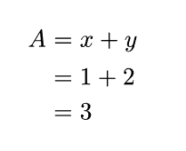

#### 数学符号与标记语法
由[上一节](#数学变量表示与引用)可知, 数学模式在特定情况下将自动以表达式的方式解析内容  

对于数学模式下的符号
* 数学模式下的符号通常使用 [sym](https://typst.app/docs/reference/symbols/sym/) 模块下的成员变量保存特定符号, 通过访问这些变量表示符号
* 除了直接访问变量名, 部分符号还可以通过快捷方式 (Shorthand) 表示符号 
* 在数学模式下, 将自动导入模块 `sym`, 如果要在数学模式外使用有关的符号需要通过 `sym.` 访问 (本节的符号默认为 `sym` 模块下)
* 具体见[数学符号表示](#数学符号表示)

对于数学模式下的标记
* 数学模式中同样主要使用 [math](https://typst.app/docs/reference/math/) 模块下的函数用于标记与表示内容, ==可以直接调用函数且不需要表达式的分隔符==
* 在函数的 `()` 中传递参数时, 将改为[脚本模式](#脚本模式)
    * 文档内容不需要 `[]` 包含, 而是==从数学模式自动解析==为文档内容
    * 如果要==表示如长度等[样式值](#样式值的表示)以及[字典与列表](#简单值的表示)==, 需要使用 `#` 或 `#{}` 通过[进入脚本模式](#表达式运作)解析, 如 `#2.5em` 
* 在数学模式下, 将自动导入模块 `math`, 如果要在数学模式外使用有关的函数需要通过 `math.` 访问 (本节的函数默认为 `math` 模块下)
* 如果使用非 `math` 模块下的函数, 建议加上省略的 `#` 以防止错误
* 数学模式下不支持通过 `[]` 传入参数, 因此需要在函数的第一个参数传入被设置的内容
* 数学模式的函数可以通过 `;` 创建嵌套数组, 该语法通常用于[矩阵](#矩阵表示)

#### 公式样式设置
数学模式的本质为函数 `equation` (注意该函数也在模块 `math` 下)  
可通过 [set 规则](#set-规则)设置该函数, 实现对公式的样式设置

函数 `equation(block, numbering, supplement)[body]` 显示公式
* `block: bool` 是否为块级数学公式, 默认为 `false`
* `numbering: str | none` 公式编号方式, 编号样式参见[笔记](#标题与目录), 默认为 `none` 即不编号
* `supplement: str` 

### 数学模式文字标记
#### 简单上下标
除了[上下标函数](#文本标记), 数学模式还支持使用标记表示右侧的上下标
* 下标 `_a`, 使用下标方式显示右侧内容
* 上标 `^a`, 使用上标方式显示右侧内容
* 如果将整个公式用于上下标, 类似[分式](#分式表示), 需要使用 `()` 包裹
* 对于单引号上标 `'` 不需要 `^` 与 `()` 也可以自动添加到符号上

#### 符号附缀
对于符号所有六个方向的附缀则需要通过数学函数实现  
函数 `attach(body, *, t, b, tl, bl, tr, br)` 
* `body: content` 被附加的符号, 通常为单个字符
* `t, b, tl, bl, tr, br: content` 六个方向的附缀

#### 上标标记
对于上标标记, 特别是多字符同时标记, 还可使用专门的上标函数  
函数 `accent(base, *, accent)` 为符号添加上标
* `base: content` 被附加的符号, 可以是多个字符的组成的[字体标记](#字体标记)
* `accent: content` 上标标记符号, 仅支持部分符号, 参见[上标符号](https://typst-doc-cn.github.io/docs/reference/math/accent/)
* 也可直接使用上标标记符号名对应的函数快捷表示上标标记
* 相比一般附缀, 该函数对于多字符的标记有优化
* 除了上标标记, 还有更复杂的可注释上下标, 参见[文档](https://typst-doc-cn.github.io/docs/reference/math/underover/)

例如以下代码
```typst
$ attach(X, tl: A, bl: Z, tr: M, br: N, t: K)space 
accent("ABC", tilde)space 
arrow("ABC")space 
dot("f")(x)space
underbrace("ABC", "123") $
```

有运行效果
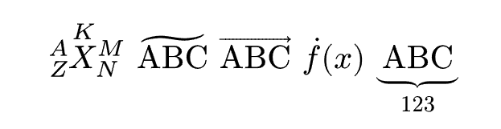

#### 删除线标记
函数 `cancel(body, *, cross, stroke)` 为内容添加删除线
* `body: content` 被标记的文档内容
* `cross: bool` 是否使用交叉删除线
* `stroke: stroke` 删除线的[线条样式](#样式值的表示)

#### 数学模式文本字体标记
在数学模式下, 变量默认使用斜体, 文本默认使用正体, 如果希望使用其他字体可使用特定的文本标记

常用的标记如下
* `upright(...)` 使用正体 (一般文本)
* `italic(...)` 使用斜体 (一般变量)
* `bold(...)` 使用粗体 (将根据传入变量或文本确定斜体与正体)
* `bb(...)` 双线体, 数学上用于表示集合
* `cal(...)` 花体, 用于表示如傅里叶变换
* `frak(...)` 代数字体

关于文本运算符 (函数), 参见[笔记](#文本运算符)

使用这些标记函数时注意, 由于函数在数学模式下使用, 多个字符应当通过 `"` 包裹内容以传入文本, 不能使用 `[]`, 例如 `bb(R)` 与 `bold("Attention")`  

### 公式结构表示
#### 括号表示
数学模式中通过智能括号
* 数学模式下的括号对能根据层级与括号内容自动调整大小
* 对于 `()`, `[]` 与 `{}` 能自动视为相互匹配的括号对
* 如果要表示单竖线括号, 需要使用函数 `abs(body)` 标记
* 如果要表示双竖线括号, 需要使用函数 `norm(body)` 标记
* 函数 `mid(body)` 将调整被标记内容大小与括号层级匹配, 如用于集合中的 `|` 

例如以下代码
```typst
$ {x in RR mid(|) sum f(x) > 10} $
```

有运行效果
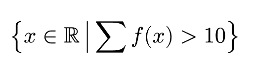

#### 分式表示
对于数学模式下的分式, 使用更自然的方式表示
* 标记 `a/b`, 将左侧部分的公式作为分子, 右侧作为分母
    * 如果分子或分母为分式, 应使用 `()` 包裹, 注意括号不会被显示 (如果要显示括号, 需要两层 `()`)
    * 分式也可使用函数 `frac(num, denom, *)` 标记

#### 根式表示
对于基础的二次根式, 使用函数 `sqrt(...)` 表示  
对于指定次根式使用函数 `root(index, radicand, *)` 表示
* `index` 根式的指数
* `radicand` 根式的内容

#### 公式空格换行与对齐
在数学模式下, 空格与换行都将被忽视
* 对于空格, 需要使用空格符号 `space` 或[间隔函数](#长度与间隔)
* 对于换行, 依然通过 `\ ` 或函数 `linebreak` 实现
* 数学模式中使用标记 `&` 用于对齐
    * 标记 `&` 左侧的部分右对齐, 右侧部分左对齐
    * 一行中允许有多个对齐, 此时优先向左对齐, 且可以连续使用

### 数学符号表示
#### 基本数学符号
此处不介绍, 可参考[官方文档](https://typst.app/docs/reference/symbols/sym/)  
* Typst 中的数学符号与 Latex 基本相同, 可在官方文档中通过输入 Latex 命令搜索
* 注意部分符号还存在快捷表示 (Shorthand)

对于各个符号都有特定的类别, 以决定其使用方式, 关于如何设置可参见[文档](https://typst.app/docs/reference/math/class/)

#### 大型运算符
大型运算符为一系列特殊的[数学符号](#基本数学符号)  
* 将自动使用大字体表示这些运算符
* 在块级公式中, 其[简单上下标](#简单上下标)将子公式放置在符号正下 / 上方
* 子公式使用 `()` 包裹, 并且通过子公式中的[换行](#公式空格换行与对齐) `\ `, 可实现多行上下标

常用的大型运算符有
* `product` 连乘, `sum` 求和
* `integral` 积分, `integral.double` 二重积分, `integral.cont` 环形积分
* 部分[文本运算符](#文本运算符), 如极限 `lim`
* 可通过[修改符号类别](#基本数学符号)使其成为大型运算符

#### 文本运算符
文本运算符为一种特殊的文本标记, 被标记的文本将被视为公式中的函数或[大型运算符](#大型运算符), 同时使用正体

函数 `op(text, *, limits)` 创建文本运算符
* `text` 文本内容
* `limits: bool` 是否作为大型运算符 (上下标为上下限形式)

对于常见的数学函数, Typst 中已经将其作为文本运算符的变量, 可以直接使用, 如
* 三角函数 `sin` 等
* 指数与对数函数 `exp`, `ln` 等
* 矩阵函数 `det`, `tr`

#### 矩阵表示
函数 `mat(delim, augment, ...rows)` 创建矩阵
* `delim: str` 矩阵边框符号, 通过左半边表示, 默认为 `(`, 可用值参见[文档](https://typst.app/docs/reference/math/mat/)
* `augment: dictionary` 矩阵分割线设置
    * 注意由[数学符号与标记语法](#数学符号与标记语法), 表示字典时需要使用 `#` 或 `#{}` 强制转换为脚本模式
    * 键 `hline, vline` 传入整数列表或整数, 表示添加横向与纵向分割线的位置 (从 1 开始索引)
    * 键 `stroke` 传入[线条样式](#样式值的表示), 表示分割线样式
* `...rows: array` 矩阵内容
    * 原始形式应传入多个列表, 表示矩阵各行内容
    * 数学模式下, 还可直接传入一系列内容, 使用 `;` 代替 `,` 表示换行

例如以下代码
```typst
$ mat(
    delim: "[",
    augment: #{
        (hline: (1, 2), vline: 3, stroke: 1pt) 
    },
    1, 2, 3, 5;
    0, 4, 8, 3;
    0, 0, 1, 2;
) $
```

有运行效果
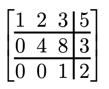

#### 分支括号
函数 `cases(delim, reverse, *, ...body)` 创建分支大括号
* `delim: str` 括号样式, 默认为 `(`
* `reverse: bool` 是否反转, 默认为左大括号
* `body: array` 各条分支内容

## 高级使用
### 幻灯片
使用第三方模块 [touying](https://typst.app/universe/package/touying/), 实现基于 Typst 的幻灯片制作

通过 Typst 生成的幻灯片为 PDF 格式, 可使用 PDF 阅读器的演示模式放映

#### 创建幻灯片
通过以下步骤即可创建一个幻灯片

* 导入模块  
`#import "@preview/touying:0.5.2": *`
* 导入幻灯片模板  
`#import themes.simple: *`
    * 可用的模板参见[文档](https://touying-typ.github.io/zh/docs/category/themes/)
* 通过 [show 规则](#show-规则) 使幻灯片模板生效  
`#show: simple-theme.with(aspect-ratio: "16-9")`
    * 通过模板方法的 `with` 函数, 可对模板进行设置, 常见参数为 `aspect-ratio`, 设置幻灯片的长宽比
    * 其他模板参数参见模板对应的文档
    * 在模板后再使用 [show, set 规则](#样式设置), 可对其他细节进行修改

例如以下代码
```typst
#import "@preview/touying:0.5.2": *
#import themes.simple: *

#show: simple-theme.with(aspect-ratio: "16-9")

= Title

== First Slide

Hello, Touying!

#pause

Hello, Typst!
```

#### 封面与目录
函数 `config-info(title, subtitle, author, date, institution)` 确定幻灯片信息
* `title, subtitle: content` 幻灯片标题与子标题
* `author, institution: content` 幻灯片作者与单位
* `date: datetime` 幻灯片时间, 传入[时间值](#样式值的表示)
* 该函数仅返回幻灯片信息, 通常需要作为一个位置参数, 通过 `with` 传入幻灯片模板

函数 `title-slide()` 创建幻灯片封面

函数 `outline()` 创建幻灯片目录, 即[目录函数](#标题与目录)

例如以下示例创建封面与目录
```typst
// 幻灯片模板
#show: metropolis-theme.with(
    aspect-ratio: "16-9",
    config-info(
        title: [Title],
        subtitle: [Subtitle],
        author: [Authors],
        date: datetime.today(),
        institution: [Institution],
    )
)

#title-slide()
#outline()
```

#### 幻灯片布局
在一般情况下, 通过[标题级别](#标题与目录)划分幻灯片
* 使用单张幻灯片存放一级标题
* 进入二级标题时, 将强制切换下一页 (也可使用函数 [pagebreak](#段落与换行))
* 进入三级标题时, 将在幻灯片中显示加粗的标题, 但不换页

此外也可使用函数对幻灯片布局
* 函数 `slide(...body)` 创建单页幻灯片
    * 当传入多个 `body` 参数时, 将使用多栏布局
* 函数 `focuse-slide(body)` 创建居中强调幻灯片, 例如结尾致谢
